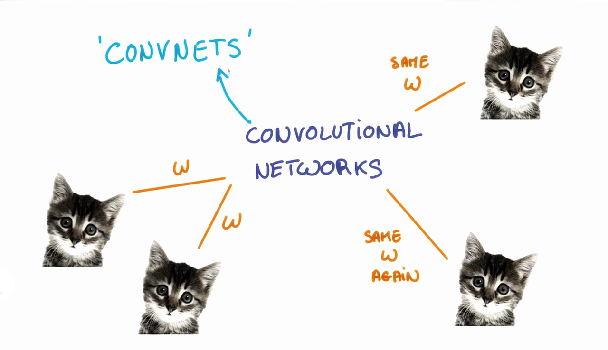
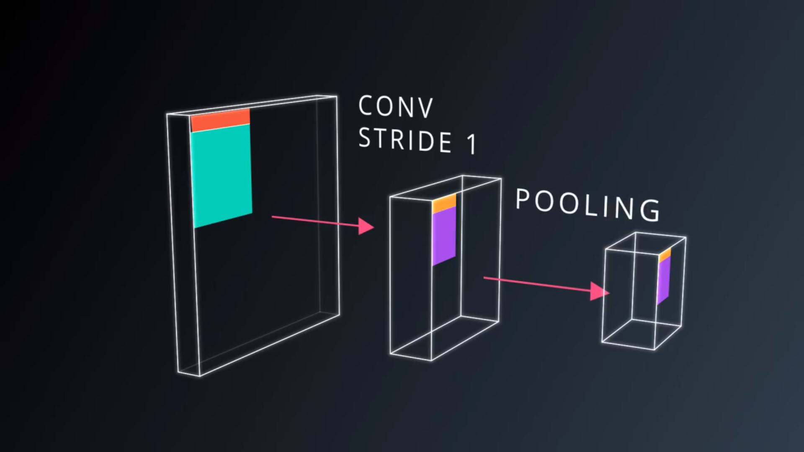

# *Udacity Self-driving Nanodegree*

## Reflection on Convolutional Neural Networks

#### *Statistical Invariance*

So far, we've talked about neural networks in general. But if we knew something about our data, for example, if it's an image or a sequence of things, we can do it a lot better. Imagine we want our network to say it's an image with a cat in it. It really doesn't matter where the cat is, it's still an image with a cat. Our network doesn't have to learn about kittens in the left corner or right corner independently. How about telling it, instead explicitly, that objects and images are largely the same whether they're on the left or on the right of the picture. This is called translation invariance. Different positions, same kitten.


Yet another example. Imagine we have a long text that talks about kittens. The mearning of kitten mostly doesn't change with its location, thus we want the network that learns from a kitten is to be used every time we see it rather than re-learn it every time. The way to achieve this is called **Weight Sharing**. When we know that two inputs contain the same kind of information, we can just share their weights and train the weights jointly for those inputs. Statistical invariance, things that don't change on average across time or space, are everywhere. For images, the idea of weights sharing will get us to the study of *Convolutional Neural Networks*. For text and sequences in general, it will lead us to *Embeddings* and *Recurrent Neural Networks*.


#### *Convolutional Neural Networks*

Now let's talk about Convolutional Neural Networks, or CovNets. ConvNets are neural networks that share their parameters across space. Suppose we have a picture, it has a width, a height, and because we usually have RGB channels, it has a depth of three. That's our input. Now imagine taking a small patch of this image, and running a tiny neural network on it, let's say, K outputs. We represent those outputs vertically in a tiny column and slide that neural network across the image without changing the weights. Just slide across invertically like we are painting it with a brush.


On the output, we draw another image with a different width, a different height, and more importantly, a different depth. Instead of just Red, Green, and Blue, we now have an output that has got many color channels, K of them. This operation is what we called **Convolution**. If our patch size were the size of the whole image, it would be no different than the regular layer of a neural network. But because we have this small patch instead, we have many fewer weights and they are shared across space. Thus a CovNet is basically a deep neural network where instead of having stacks of matrix multiply layers, we use stacks of convolutions.


In general, those layers will form a pyramid. At the bottom, we have this big image with a very shallow depth just R, G, and B. We will apply convolutions which progressively squeeze the spacial dimensions while increasing the depth which corresponds roughly to the semantic complexity of our representation. At the top, we can put our classifier. Here we have a representation where all the spacial information has been squeezed out, and only parameters that map to the content of the image remain. By the way, patches are sometimes also called kernels and each channels of our input can also be called as a feature map.


#### *Filters*

The first step for a CNN is to break up the image into smaller pieces. We do this by selecting a width and height that defines a filter.

The filter looks at small pieces, or patches, of the image. These patches are the same size as the filter. We then simply slide this filter horizontally or vertically to focus on a different piece of the image.


The amount by which the filter slides is referred to as the **stride**. The stride is a hyperparameter which you, the engineer, can tune. Increasing the stride reduces the size of your model by reducing the number of total patches each layer observes. However, this usually comes with a reduction in accuracy.

Let’s look at an example. In this zoomed in image of the dog, we first start with the patch outlined in red. The width and height of our filter define the size of this square.


We then move the square over to the right by a given stride (2 in this case) to get another patch.


What's important here is that we are **grouping together adjacent pixels** and treating them as a collective.

In a normal, non-convolutional neural network, we would have ignored this adjacency. In a normal network, we would have connected every pixel in the input image to a neuron in the next layer. In doing so, we would not have taken advantage of the fact that pixels in an image are close together for a reason and have special meaning.

By taking advantage of this local structure, our CNN learns to classify local patterns, like shapes and objects, in an image.

#### *Filter Depth*

It's common to have more than one filter. Different filters pick up different qualities of a patch. For example, one filter might look for a particular color, while another might look for a kind of object of a specific shape. The amount of filters in a convolutional layer is called the **filter depth**, remember, this is not the depth of each filter's size, which stays the same with the inputs size to match the amount of weights.

How many neurons does each patch connect to?

That’s dependent on our filter depth. If we have a depth of k, we connect each patch of pixels to k neurons in the next layer. This gives us the height of k in the next layer, as shown below. In practice, k is a hyperparameter we tune, and most CNNs tend to pick the same starting values.


But why connect a single patch to multiple neurons in the next layer? Isn’t one neuron good enough?

Multiple neurons can be useful because a patch can have multiple interesting characteristics that we want to capture.

For example, one patch might include some white teeth, some blonde whiskers, and part of a red tongue. In that case, we might want a filter depth of at least three - one for each of teeth, whiskers, and tongue.


Having multiple neurons for a given patch ensures that our CNN can learn to capture whatever characteristics the CNN learns are important.

Remember that the CNN isn't "programmed" to look for certain characteristics. Rather, it learns **on its own** which characteristics to notice.

#### *Parameters*

When we are trying to classify a picture of a cat, we don’t care where in the image a cat is. If it’s in the top left or the bottom right, it’s still a cat in our eyes. We would like our CNNs to also possess this ability known as translation invariance. How can we achieve this?

As we saw earlier, the classification of a given patch in an image is determined by the weights and biases corresponding to that patch.

If we want a cat that’s in the top left patch to be classified in the same way as a cat in the bottom right patch, we need the weights and biases corresponding to those patches to be the same, so that they are classified the same way.

This is exactly what we do in CNNs. The weights and biases we learn for a given output layer are shared across all patches in a given input layer. Note that as we increase the depth of our filter, the number of weights and biases we have to learn still increases, as the weights aren't shared across the output channels.

There’s an additional benefit to sharing our parameters. If we did not reuse the same weights across all patches, we would have to learn new parameters for every single patch and hidden layer neuron pair. This does not scale well, especially for higher fidelity images. Thus, sharing parameters not only helps us with translation invariance, but also gives us a smaller, more scalable model.


In fact, the width and height of each subsequent layer decreases naturally in the above scheme when we apply convolution between our layers. Below is a 5x5 grid with a 3x3 filter.


In an ideal world, we'd be able to maintain the same width and height across layers so that we can continue to add layers without worrying about the dimensionality shrinking and so that we have consistency. How might we achieve this? One way is to simply add a border of 0s to our original 5x5 image. You can see what this looks like in the below image. This would expand our original image to a 7x7. With this, we now see how our next layer's size is again a 5x5, keeping our dimensionality consistent.


#### *Dimensionality*

From what we've learned so far, we can easily calculate the number of neurons of each layer in our CNN.

Given:

* our input layer has a width of W and a height of H
* our convolutional layer has a filter size F
* a stride of S
* a padding of P
* the number of filters K

Thus we have the width of the next layer: `W_out =[ (W−F+2P)/S] + 1`.

The output height would be `H_out = [(H-F+2P)/S] + 1`.

And the output depth would be equal to the number of filters `D_out = K`.

The output volume would be `W_out * H_out * D_out`.

Knowing the dimensionality of each additional layer helps us understand how large our model is and how our decisions around filter size and stride affect the size of our network.

#### *TensorFlow Convolution Layer*

Let's examine how to implement a CNN in TensorFlow.

TensorFlow provides the `tf.nn.conv2d()` and `tf.nn.bias_add()` functions to create your own convolutional layers.

```python
# Output depth
k_output = 64

# Image Properties
image_width = 10
image_height = 10
color_channels = 3

# Convolution filter
filter_size_width = 5
filter_size_height = 5

# Input/Image
input = tf.placeholder(
    tf.float32,
    shape=[None, image_height, image_width, color_channels])

# Weight and bias
weight = tf.Variable(tf.truncated_normal(
    [filter_size_height, filter_size_width, color_channels, k_output]))
bias = tf.Variable(tf.zeros(k_output))

# Apply Convolution
conv_layer = tf.nn.conv2d(input, weight, strides=[1, 2, 2, 1], padding='SAME')
# Add bias
conv_layer = tf.nn.bias_add(conv_layer, bias)
# Apply activation function
conv_layer = tf.nn.relu(conv_layer)
```

#### *Pooling*

Now that we've seen what a simple CovNet looks like, there are many things we can do to improve it. The first improvement is a good way to reduce the spatial extent of our feature maps in the convolutional pyramid. Until now, we've used striding to shift the filters by a few pixels each time and reduce the feature map size. This is a very aggressive way to down sample an image since it removes a lot of information. What if instead of skipping one in every two convolutions, we still run with a very small stride, say for example, one but then took all the convolutions in a neighborhood and combine them somehow? This operation is called pooling, and there are a few ways to implement, max pooling and average pooling.


There are some advantages to using pooling. First, it doesn't add to the number of parameters, so we don't risk an increase in over fitting. Second, it simply often yields a more accurate model by forcing our model focus more on important elements. However, since the convolutions that went below run at lower stride, the model then become more expensive to compute. And now we introduce two more hyper-parameters, the pooling rigion size and the pooling stride. The formulas for size computing are similar:
`new_height = (input_height - filter_height)/S + 1`
`new_width = (input_width - filter_width)/S + 1`


A very typical architecture for a CovNet is a few layers alternating convolutions and max pooling, followed by a few fully connected layers at the top. The first famous model to use this architecture was LeNet-5 designed by Yan-Lecun to do character recognization back in 1998. Modern convolutional networks, such as AlexNet, which famously won the competitive ImageNet object recognition challenge in 2012, used the same architecture with a few wrinkles.


TensorFlow provides the tf.nn.max_pool() function to apply max pooling to your convolutional layers.

```python
...
conv_layer = tf.nn.conv2d(input, weight, strides=[1, 2, 2, 1], padding='SAME')
conv_layer = tf.nn.bias_add(conv_layer, bias)
conv_layer = tf.nn.relu(conv_layer)
# Apply Max Pooling
conv_layer = tf.nn.max_pool(
    conv_layer,
    ksize=[1, 2, 2, 1],
    strides=[1, 2, 2, 1],
    padding='SAME')
```

#### *1x1 Convolutions*

You might wonder, why we would ever want to use 1x1 Convolutions? They're not really looking at a patch of the image, just one pixel. Look at the classic convolution setting, it's basically a small classifier for a patch of image, but it's only a linear classifier for those KxK pixels. But if we add a 1x1 Convolution in the middle, suddenly we have a mini neural network running over the patch instead of a linear classifier. Interspersing our convolutions with 1x1 Convolutions is a very inexpensive way to make our models deeper and have more parameters without completely changing the structure. And it's also easy to compute since they are just matrix multiplies with relatively few parameters. Both pooling and 1x1 Convolutions are techniques that make our convolution pyramid more concise and efficient.


#### *Inception Module*

The idea of Inception Module is that, at each layer of our CovNet, we can make a choice have a pooling operation, have a convolution. And then we need to decide, it's a 1x1 or a 3x3 or a 5x5 convolution. All of thede are actually beneficial to the modeling power of our network, so why not use them all. Here's what an Inception Module looks like. Instead of having single convolution, we have a composition of pooling followed by a 1x1, then a 1x1 convolution, then a 1x1 followed by a 3x3, then a 1x1 followed by a 5x5. And at the top, we simply concatenate the output of each of them. Although the structure looks complicated, the total number of parameters in our model is very small as we simply arrange the sequence of the same modules.
