# *Udacity Self-driving Nanodegree*

## Reflection on Deep Neural Networks

#### *Linear Models are limited*

So far we still using logistic classifier which is fundamentally a linear model. However in most situations, we would like our model to be nonlinear, and we can't just keep multiplying our inputs by linear funtions, because that's just equivalent to one big linear function.
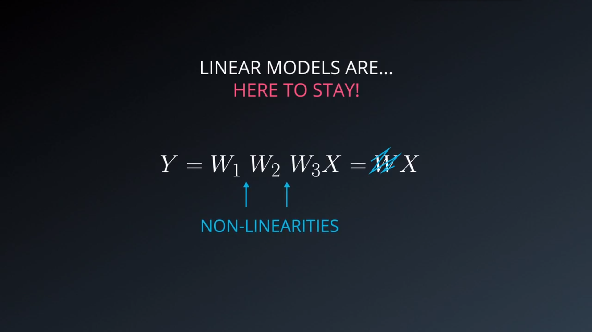

#### *Rectified Linear Units*

ReLUs are the simplest non-linear functions we can think of. They're linear if x > 0 and they're 0 everywhere else.
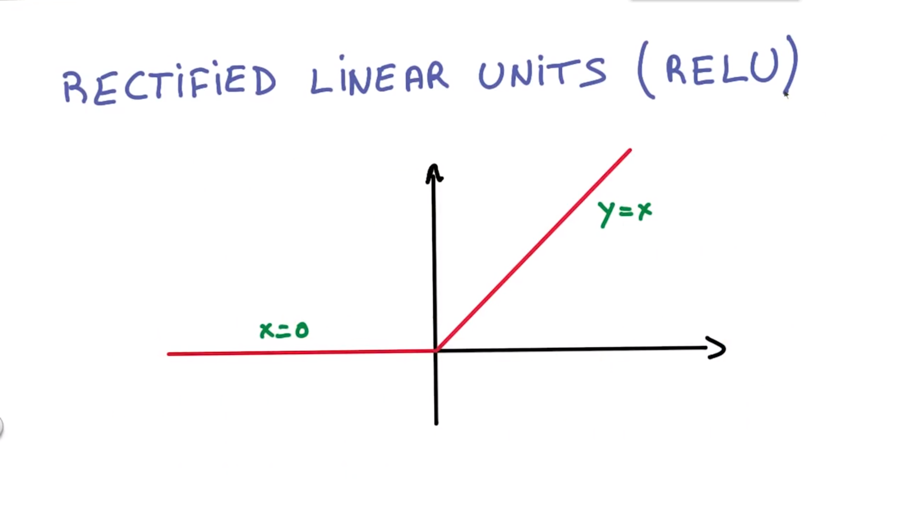

#### *Network of ReLUs*

Now with the help of ReLU, we want to do the minimal amount of change to make our logistic classifier nonlinear. Instead of having a single matrix multiply as our classifier, we are going to inset a ReLU right in the middle. We now have two matrices, one going from the inputs to the ReLUs, and another one connecting the ReLUs to the classifier. In this way, we can solve two of our problems. Our function is now nonlinear, thanks to the ReLU in the middle, and we have a new knob that we can tune the number H which corresponds to the number of ReLU units that we have in the classifier. We can make it as big as we want.
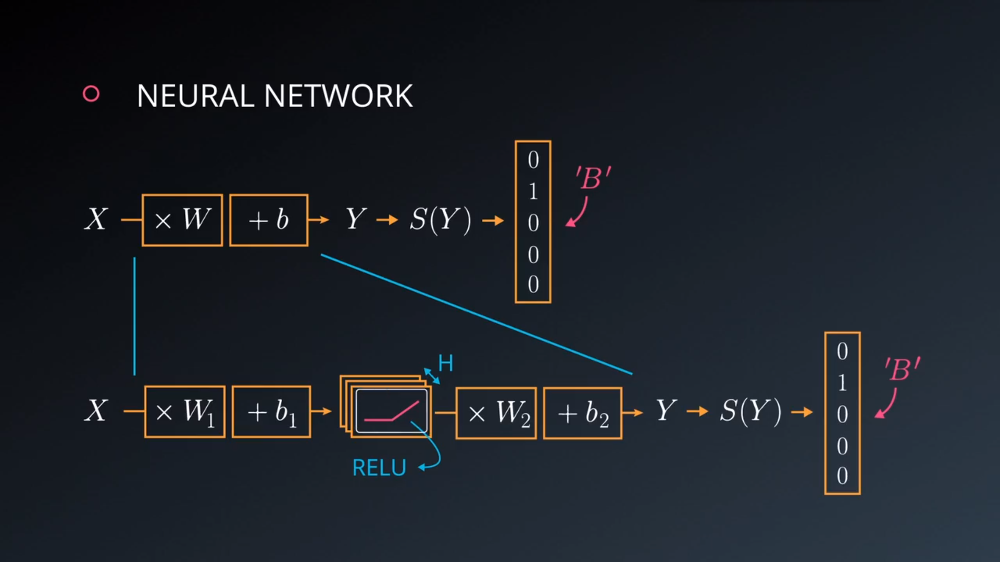

 TensorFlow provides the ReLU function as tf.nn.relu(), as shown below:

```python
# Hidden Layer with ReLU activation function
hidden_layer = tf.add(tf.matmul(features, hidden_weights), hidden_biases)
hidden_layer = tf.nn.relu(hidden_layer)

output = tf.add(tf.matmul(hidden_layer, output_weights), output_biases)
```

#### *Backprop*

Just like what we did in linear models, when we apply our data to the input x, we have data flowing through the stack up to our final predictions y. To cumpute the derivatives, the data flows backwards through the network, gets combined with the chain rule and produces gradients. Running the model up to the predictions is often called the forward prop, and the model that goes backwards is called the back prop. So in stochastic gradient descent, for every single batch of our data in training set, we are going to run the forward prop and then the back prop. And that will give us gradient for each of our weights in our model. Then we will apply those gradients with learning rates to our original weights and update them. We will repeat this whole process many many times to get our entire model optimized. In particular, each block of the back prop often takes about twice the memory that's needed for forward prop and twice to compute. That's important when we want to size our model and fit in memory for example.
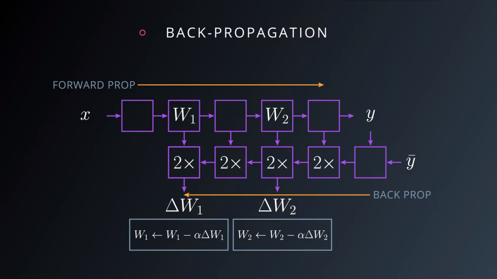

#### *Training a Deep Neural Network*

Now we have a small neural network, it's not particularly deep, just 2 layers. We can make it bigger and more complex by increasing the size of that hidden layer in the middle, but it turns out that increase this H is not particularly efficient in general. We need to make it really really large and then it gets really hard to train. Instead we can simply increase the amount of hidden layers and make the model deeper. That's where the central idea of deep learning comes to play.
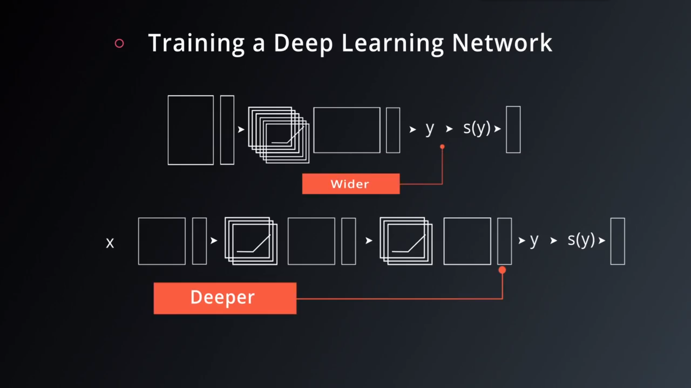

There are several good reasons to do so. One is parameter efficiency, we can typically get much more performance with pure parameters by going deeper, rather than wider. Another one is that a lot of natural phenomena, that we get interested in, tend to have a hierarchical structure which deep models naturally capture. If we poke at a model for images and visualize what the model learns, we often find very simple things at the lowest layers, like lines or edges. Once we move up, we tend to see more complicated things like geometric shapes. Go further up, and we start seeing things like objects, faces. This is very powerful, because the model structure matches the kind of abstractions that we might expect to see in our data, and as a result the model has an easier time learning them.
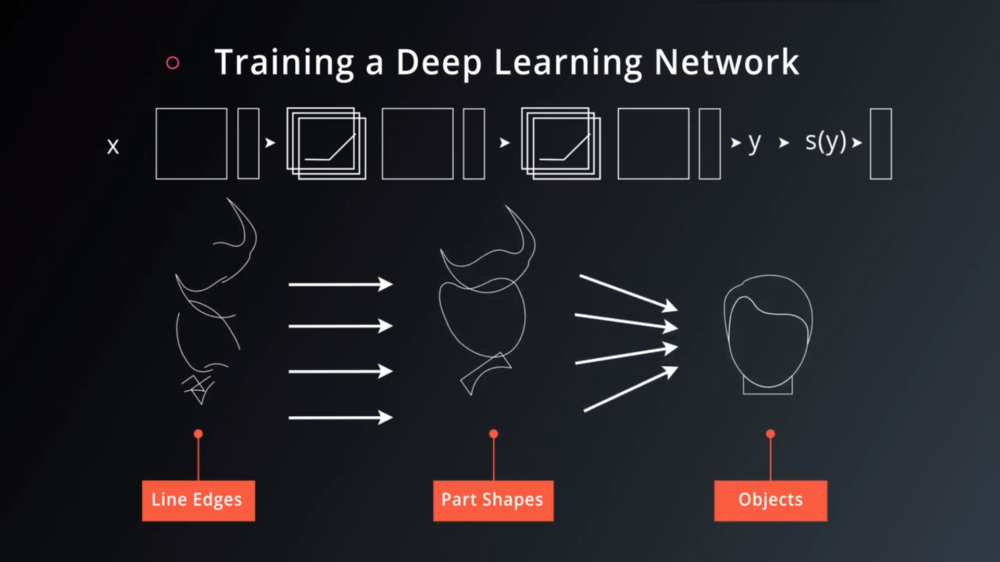

You've seen how to build a logistic classifier using TensorFlow. Now you're going to see how to use the logistic classifier to build a deep neural network.

```python
### TensorFlow MNIST
from tensorflow.examples.tutorials.mnist import input_data
mnist = input_data.read_data_sets(".", one_hot=True, reshape=False)

### Learning Parameters
import tensorflow as tf

### Parameters
learning_rate = 0.001
training_epochs = 20
batch_size = 128  # Decrease batch size if you don't have enough memory
display_step = 1

n_input = 784  # MNIST data input (img shape: 28*28)
n_classes = 10  # MNIST total classes (0-9 digits)

### Hidden Layer Parameters
n_hidden_layer = 256 # layer number of features

### Store layers weight & bias
weights = {
    'hidden_layer': tf.Variable(tf.random_normal([n_input, n_hidden_layer])),
    'out': tf.Variable(tf.random_normal([n_hidden_layer, n_classes]))
}
biases = {
    'hidden_layer': tf.Variable(tf.random_normal([n_hidden_layer])),
    'out': tf.Variable(tf.random_normal([n_classes]))
}

### tf Graph input
x = tf.placeholder("float", [None, 28, 28, 1])
y = tf.placeholder("float", [None, n_classes])

x_flat = tf.reshape(x, [-1, n_input])

### Multilayer Perceptron
# Hidden layer with RELU activation
layer_1 = tf.add(tf.matmul(x_flat, weights['hidden_layer']),/
    biases['hidden_layer'])
layer_1 = tf.nn.relu(layer_1)
# Output layer with linear activation
logits = tf.add(tf.matmul(layer_1, weights['out']), biases['out'])

### Define loss and optimizer
cost = tf.reduce_mean(/
    tf.nn.softmax_cross_entropy_with_logits(logits=logits, labels=y))
optimizer = tf.train.GradientDescentOptimizer(learning_rate=learning_rate)/
    .minimize(cost)

### Initializing the variables
init = tf.global_variables_initializer()

### Launch the graph
with tf.Session() as sess:
    sess.run(init)
    # Training cycle
    for epoch in range(training_epochs):
        total_batch = int(mnist.train.num_examples/batch_size)
        # Loop over all batches
        for i in range(total_batch):
            batch_x, batch_y = mnist.train.next_batch(batch_size)
            # Run optimization op (backprop) and cost op (to get loss value)
            sess.run(optimizer, feed_dict={x: batch_x, y: batch_y})
```

#### *Save and Restore TensorFlow Models*

Training a model can take hours. But once you close your TensorFlow session, you lose all the trained weights and biases. If you were to reuse the model in the future, you would have to train it all over again!

Fortunately, TensorFlow gives you the ability to save your progress using a class called `tf.train.Saver`. This class provides the functionality to save any `tf.Variable` to your file system.

**Saving Variables**
Let's start with a simple example of saving `weights` and `bias` Tensors. For the first example you'll just save two variables. Later examples will save all the weights in a practical model.

```python
import tensorflow as tf

# The file path to save the data
save_file = './model.ckpt'

# Two Tensor Variables: weights and bias
weights = tf.Variable(tf.truncated_normal([2, 3]))
bias = tf.Variable(tf.truncated_normal([3]))

# Class used to save and/or restore Tensor Variables
saver = tf.train.Saver()

with tf.Session() as sess:
    # Initialize all the Variables
    sess.run(tf.global_variables_initializer())

    # Show the values of weights and bias
    print('Weights:')
    print(sess.run(weights))
    print('Bias:')
    print(sess.run(bias))

    # Save the model
    saver.save(sess, save_file)
```

---
Weights:

[[-0.97990924 1.03016174 0.74119264]

[-0.82581609 -0.07361362 -0.86653847]]

Bias:

[ 1.62978125 -0.37812829 0.64723819]

---

**Loading Variables**
Now that the Tensor Variables are saved, let's load them back into a new model.

```python
# Remove the previous weights and bias
tf.reset_default_graph()

# Two Variables: weights and bias
weights = tf.Variable(tf.truncated_normal([2, 3]))
bias = tf.Variable(tf.truncated_normal([3]))

# Class used to save and/or restore Tensor Variables
saver = tf.train.Saver()

with tf.Session() as sess:
    # Load the weights and bias
    saver.restore(sess, save_file)

    # Show the values of weights and bias
    print('Weight:')
    print(sess.run(weights))
    print('Bias:')
    print(sess.run(bias))
```

---
Weights:

[[-0.97990924 1.03016174 0.74119264]

[-0.82581609 -0.07361362 -0.86653847]]

Bias:

[ 1.62978125 -0.37812829 0.64723819]

---

**Save a Trained Model**
Let's see how to train a model and save its weights.

First start with a model:

```python
# Remove previous Tensors and Operations
tf.reset_default_graph()

from tensorflow.examples.tutorials.mnist import input_data
import numpy as np

learning_rate = 0.001
n_input = 784  # MNIST data input (img shape: 28*28)
n_classes = 10  # MNIST total classes (0-9 digits)

# Import MNIST data
mnist = input_data.read_data_sets('.', one_hot=True)

# Features and Labels
features = tf.placeholder(tf.float32, [None, n_input])
labels = tf.placeholder(tf.float32, [None, n_classes])

# Weights & bias
weights = tf.Variable(tf.random_normal([n_input, n_classes]))
bias = tf.Variable(tf.random_normal([n_classes]))

# Logits - xW + b
logits = tf.add(tf.matmul(features, weights), bias)

# Define loss and optimizer
cost = tf.reduce_mean(/
    tf.nn.softmax_cross_entropy_with_logits(logits=logits, labels=labels))
optimizer = tf.train.GradientDescentOptimizer(learning_rate=learning_rate)/
    .minimize(cost)

# Calculate accuracy
correct_prediction = tf.equal(tf.argmax(logits, 1), tf.argmax(labels, 1))
accuracy = tf.reduce_mean(tf.cast(correct_prediction, tf.float32))
```

Let's train that model, then save the weights:

```python
import math

save_file = './train_model.ckpt'
batch_size = 128
n_epochs = 100

saver = tf.train.Saver()

# Launch the graph
with tf.Session() as sess:
    sess.run(tf.global_variables_initializer())

    # Training cycle
    for epoch in range(n_epochs):
        total_batch = math.ceil(mnist.train.num_examples / batch_size)

        # Loop over all batches
        for i in range(total_batch):
            batch_features, batch_labels = mnist.train.next_batch(batch_size)
            sess.run(
                optimizer,
                feed_dict={features: batch_features, labels: batch_labels})

        # Print status for every 10 epochs
        if epoch % 10 == 0:
            valid_accuracy = sess.run(
                accuracy,
                feed_dict={
                    features: mnist.validation.images,
                    labels: mnist.validation.labels})
            print('Epoch {:<3} - Validation Accuracy: {}'.format(
                epoch,
                valid_accuracy))

    # Save the model
    saver.save(sess, save_file)
    print('Trained Model Saved.')
```

---
Epoch 0 - Validation Accuracy: 0.06859999895095825

Epoch 10 - Validation Accuracy: 0.20239999890327454

Epoch 20 - Validation Accuracy: 0.36980000138282776

Epoch 30 - Validation Accuracy: 0.48820000886917114

Epoch 40 - Validation Accuracy: 0.5601999759674072

Epoch 50 - Validation Accuracy: 0.6097999811172485

Epoch 60 - Validation Accuracy: 0.6425999999046326

Epoch 70 - Validation Accuracy: 0.6733999848365784

Epoch 80 - Validation Accuracy: 0.6916000247001648

Epoch 90 - Validation Accuracy: 0.7113999724388123

Trained Model Saved.

---

**Load a Trained Model**
Let's load the weights and bias from memory, then check the test accuracy.

```python
saver = tf.train.Saver()

# Launch the graph
with tf.Session() as sess:
    saver.restore(sess, save_file)

    test_accuracy = sess.run(
        accuracy,
        feed_dict={features: mnist.test.images, labels: mnist.test.labels})

print('Test Accuracy: {}'.format(test_accuracy))
```

---
Test Accuracy: 0.7229999899864197

That's everything we should know about how to save and load a trained model in TensorFlow.

---

**Finetuning**
Sometimes you might want to adjust, or "finetune" a model that you have already trained and saved.

However, loading saved Variables directly into a modified model can generate errors. Let's go over how to avoid these problems.

TensorFlow uses a string identifier for Tensors and Operations called `name`. If a name is not given, TensorFlow will create one automatically. TensorFlow will give the first node the name `<Type>`, and then give the name `<Type>_<number>` for the subsequent nodes. Let's see how this can affect loading a model with a different order of `weights` and `bias`:

```python
import tensorflow as tf

# Remove the previous weights and bias
tf.reset_default_graph()

save_file = 'model.ckpt'

# Two Tensor Variables: weights and bias
weights = tf.Variable(tf.truncated_normal([2, 3]))
bias = tf.Variable(tf.truncated_normal([3]))

saver = tf.train.Saver()

# Print the name of Weights and Bias
print('Save Weights: {}'.format(weights.name))
print('Save Bias: {}'.format(bias.name))

with tf.Session() as sess:
    sess.run(tf.global_variables_initializer())
    saver.save(sess, save_file)

# Remove the previous weights and bias
tf.reset_default_graph()

# Two Variables: weights and bias
bias = tf.Variable(tf.truncated_normal([3]))
weights = tf.Variable(tf.truncated_normal([2, 3]))

saver = tf.train.Saver()

# Print the name of Weights and Bias
print('Load Weights: {}'.format(weights.name))
print('Load Bias: {}'.format(bias.name))

with tf.Session() as sess:
    # Load the weights and bias - ERROR
    saver.restore(sess, save_file)
```

---
Save Weights: Variable:0

Save Bias: Variable_1:0

Load Weights: Variable_1:0

Load Bias: Variable:0

...

InvalidArgumentError (see above for traceback): Assign requires shapes of both tensors to match.

...

---
You'll notice that the `name` properties for `weights` and `bias` are different than when you saved the model. This is why the code produces the "Assign requires shapes of both tensors to match" error. The code `saver.restore(sess, save_file)` is trying to load weight data into `bias` and bias data into `weights`.

Instead of letting TensorFlow set the `name` property, let's set it manually:

```python
import tensorflow as tf

tf.reset_default_graph()

save_file = 'model.ckpt'

# Two Tensor Variables: weights and bias
weights = tf.Variable(tf.truncated_normal([2, 3]), name='weights_0')
bias = tf.Variable(tf.truncated_normal([3]), name='bias_0')

saver = tf.train.Saver()

# Print the name of Weights and Bias
print('Save Weights: {}'.format(weights.name))
print('Save Bias: {}'.format(bias.name))

with tf.Session() as sess:
    sess.run(tf.global_variables_initializer())
    saver.save(sess, save_file)

# Remove the previous weights and bias
tf.reset_default_graph()

# Two Variables: weights and bias
bias = tf.Variable(tf.truncated_normal([3]), name='bias_0')
weights = tf.Variable(tf.truncated_normal([2, 3]) ,name='weights_0')

saver = tf.train.Saver()

# Print the name of Weights and Bias
print('Load Weights: {}'.format(weights.name))
print('Load Bias: {}'.format(bias.name))

with tf.Session() as sess:
    # Load the weights and bias - No Error
    saver.restore(sess, save_file)

print('Loaded Weights and Bias successfully.')
```

---
Save Weights: weights_0:0

Save Bias: bias_0:0

Load Weights: weights_0:0

Load Bias: bias_0:0

Loaded Weights and Bias successfully.

---

That worked! The Tensor names match and the data loaded correctly.

#### *Overfitting issue*

Why did we not figure our earlier that deep models were effective? Many reasons, but mostly because deep models only really shine if we have enough data to train them. It's only in recent years that large datasets have made their way to the academic world. In practice, we always try networks that are way too big for our data and then try our best to prevent them from overfitting. The first way we prevent from over-fitting is by looking at the performance on our validation set. We should stop our train as soon as the model stop improving. It's called early termination and it's still the best way to prevent our network from over optimizing on the training set.
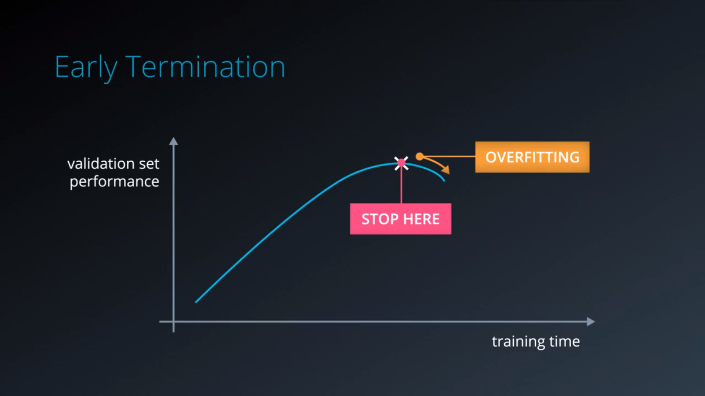

Another way is to apply **regularization**. Regularizing means applying artificial constraints on our network, that implicitly reduce the number of free parameters while not making it more difficult to optmize. The way we use in deep learning is called L2 Regularization. The idea is to add another term to the loss, which penalizes large weights and multiplied by a small constant. And yes, we have another hyper-parameter to tune in.
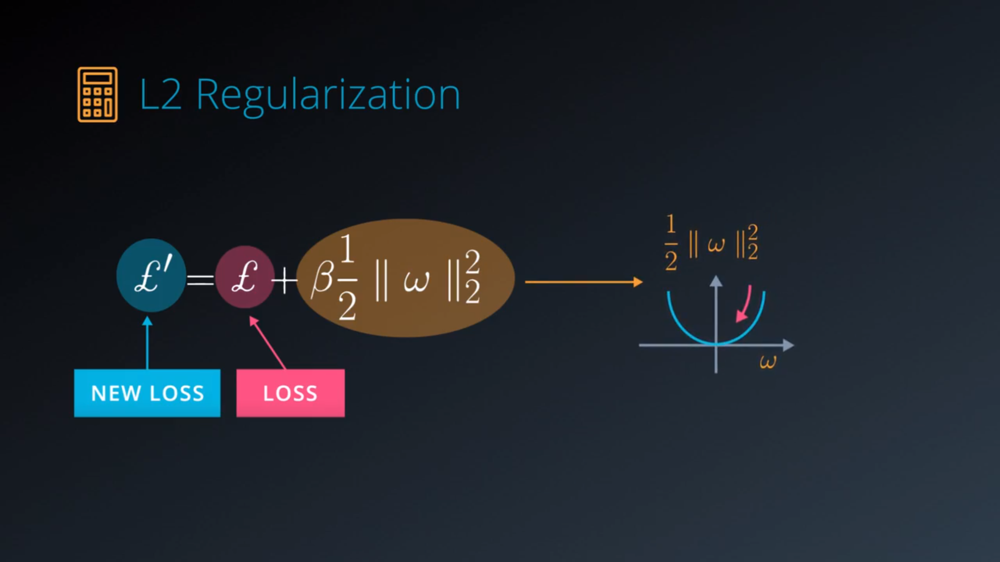

#### *Dropout*

There's another important technique for regularization that only emerged relatively recently and works amazingly well. It's called **Dropout**. Dropout works like this. Imagine that we have one layer that connects to another layer. The values that go from one layer to the next are often called activations. Now take those activations and randomly, for every sample we train our network on, set half of them to 0. Completely and randomly, we basically take half of the data that's flowing through our network and just destroy it and then randomly again.
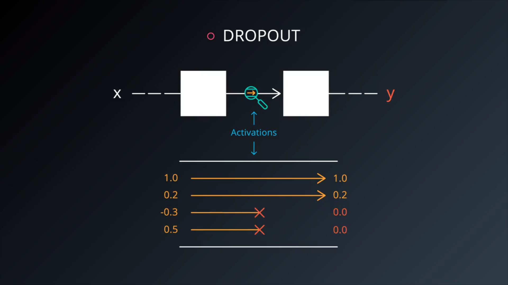

So what actually happens with dropout? In fact, our network can never rely on any given activation to be present, because they might be squashed at any given moment. So it is forced to learn a redundant representation for everything to make sure that it at least some of the information remains. One activation get smashed, but there's always one or more do the same job. 
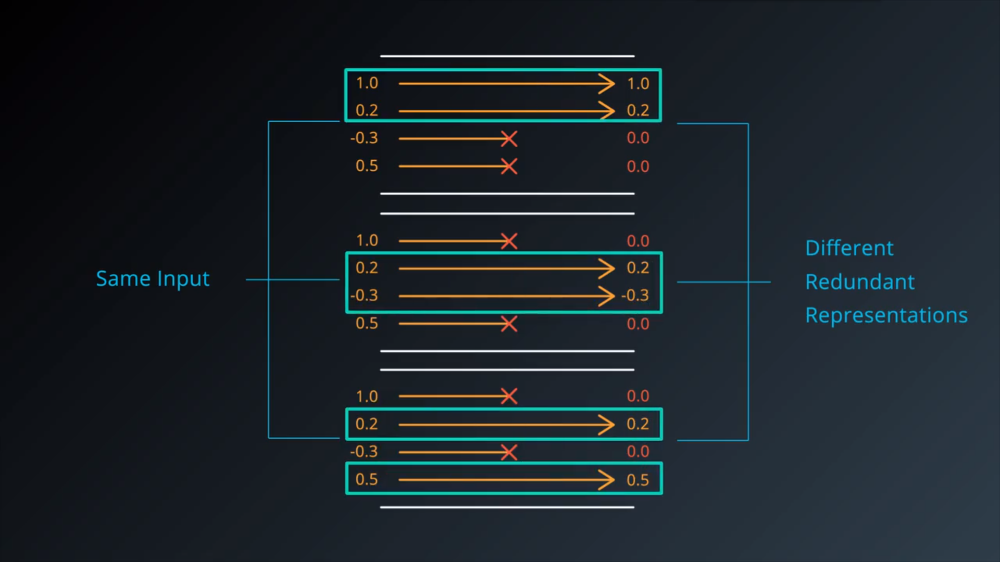

Forcing our network to learn redundant representations might sound very inefficient. But in practice, it makes things more robust and prevents over-fitting. It also makes our network act as if taking the consensus over an ensemble of networks, which is always a good way to improve performance. If even dropout doesn't work for us, we can only use a bigger network.
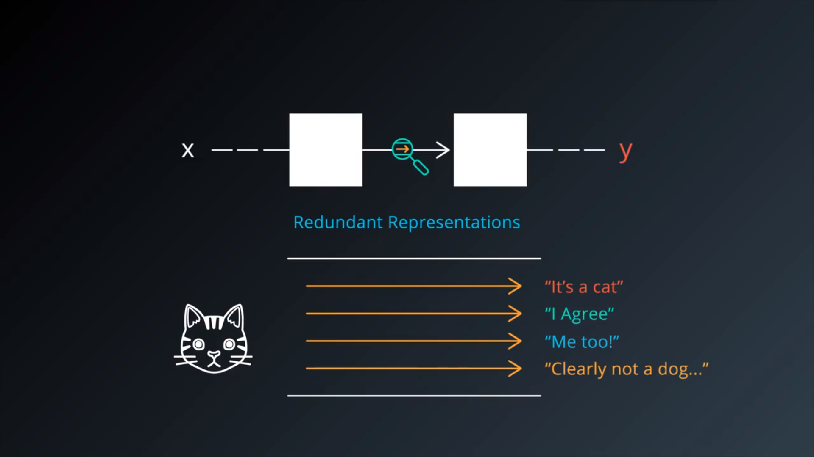

TensorFlow provides the tf.nn.dropout() function, which takes in two parameters:

* hidden_layer: the tensor to which you would like to apply dropout
* keep_prob: the probability of keeping (i.e. not dropping) any given unit

```python
keep_prob = tf.placeholder(tf.float32) # probability to keep units

hidden_layer = tf.add(tf.matmul(features, weights[0]), biases[0])
hidden_layer = tf.nn.relu(hidden_layer)
hidden_layer = tf.nn.dropout(hidden_layer, keep_prob)

logits = tf.add(tf.matmul(hidden_layer, weights[1]), biases[1])
```

One thing that we should always mind:

* During training, a good starting value for keep_prob is 0.5.
* During testing, use a keep_prob value of 1.0 to keep all units and maximize the power of the model.

```python
...

with tf.Session() as sess:
    sess.run(tf.global_variables_initializer())

    for epoch_i in range(epochs):
        for batch_i in range(batches):
            ....

            sess.run(optimizer, feed_dict={
                features: batch_features,
                labels: batch_labels,
                keep_prob: 0.5})

    validation_accuracy = sess.run(accuracy, feed_dict={
        features: test_features,
        labels: test_labels,
        keep_prob: 0.5})
```
