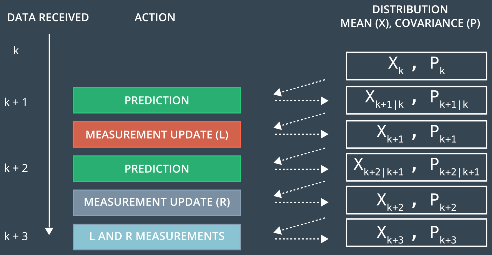
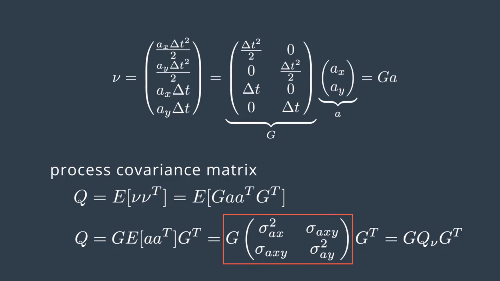
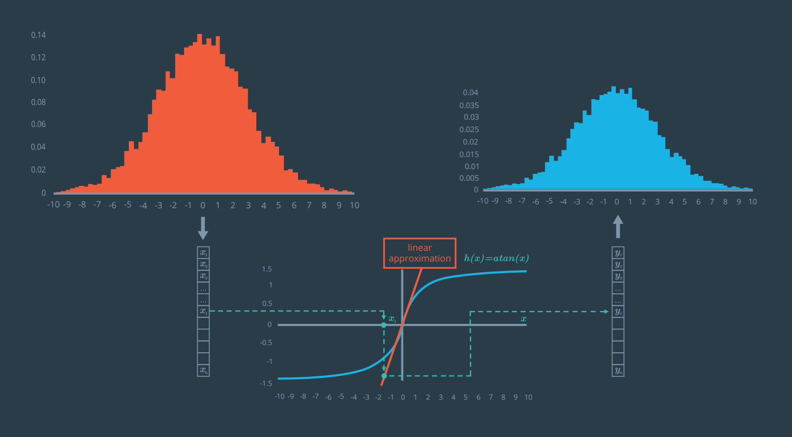

# *Udacity Self-driving Nanodegree*

## Reflection on Extended Kalman Filters

#### *Intro*

Now that we've seen Kalman Filters, we can now implement that in Sensor Fusion. We will build an Extended Kalman Filter, which also names EKF in short. It's extended in the sense that it will be capable of handling more complex motion models and measurement models. Below is the overall processing flow:

#### *KF recall*

The Kalman Filter algorithm will go through the following steps:

* ***first measurement*** - the filter will receive initial measurements of the bicycle's position relative to the car. These measurements will come from a radar or lidar sensor.
* ***initialize state and covariance matrices*** - the filter will initialize the bicycle's position based on the first measurement.
* then the car will receive another sensor measurement after a time period $\Delta t$.
* ***predict*** - the algorithm will predict where the bicycle will be after time $\Delta t$. One basic way to predict the bicycle location after $\Delta t$ is to assume the bicycle's velocity is constant; thus the bicycle will have moved velocity * $\Delta t$. In the extended Kalman filter lesson, we will assume the velocity is constant.
* ***update*** - the filter compares the "predicted" location with what the sensor measurement says. The predicted location and the measured location are combined to give an updated location. The Kalman filter will put more weight on either the predicted location or the measured location depending on the uncertainty of each value.
* then the car will receive another sensor measurement after a time period $\Delta t$. The algorithm then does another predict and update step.

#### *Estimation Problem Refresh*

For Sensor Fusion, we can keep the same processing flow with the difference that each sensor is going to have its own prediction update scheme. In other words, the belief about the pedestrian's position and velocity is updated asynchronously each time new measurement is received regardless the source sensor.

#### *1-D Formula*

**Prediction**
Let's say we know an object's current position and velocity , which we keep in the $x$ variable. Now one second has passed. We can predict where the object will be one second later because we knew the object position and velocity one second ago; we'll just assume the object kept going at the same velocity.

The $x' = Fx + \nu$ equation does these prediction calculations for us.

But maybe the object didn't maintain the exact same velocity. Maybe the object changed direction, accelerated or decelerated. So when we predict the position one second later, our uncertainty increases. $P' = FPF^T + Q$ represents this increase in uncertainty.

Process noise refers to the uncertainty in the prediction step. We assume the object travels at a constant velocity, but in reality, the object might accelerate or decelerate. The notation $\nu ∼ N(0, Q)$ defines the process noise as a gaussian distribution with mean zero and covariance $Q$.

**Update**
Now we get some sensor information that tells where the object is relative to the car. First we compare where we think we are with what the sensor data tells us $y = z - Hx'$.

The $K$ matrix, often called the Kalman filter gain, combines the uncertainty of where we think we are $P'$ with the uncertainty of our sensor measurement $R$. If our sensor measurements are very uncertain ($R$ is high relative to $P'$), then the Kalman filter will give more weight to where we think we are: $x'$. If where we think we are is uncertain ($P'$ is high relative to $R$), the Kalman filter will put more weight on the sensor measurement: $z$.

Measurement noise refers to uncertainty in sensor measurements. The notation $\omega ∼ N(0, R)$ defines the measurement noise as a gaussian distribution with mean zero and covariance $R$. Measurement noise comes from uncertainty in sensor measurements.

**A Note About the State Transition Function: Bu**
If you go back to the video, you'll notice that the state transition function was first given as $x' = Fx + Bu + \nu$

But then $Bu$ was crossed out leaving $x' = Fx + \nu$

$B$ is a matrix called the control input matrix and $u$ is the control vector.

For the Kalman filter lessons, we will assume that there is no way to measure or know the exact acceleration of a tracked object. For example, if we were in an autonomous vehicle tracking a bicycle, pedestrian or another car, we would not be able to model the internal forces of the other object; hence, we do not know for certain what the other object's acceleration is. Instead, we will set $Bu = 0$ and represent acceleration as a random noise with mean $\nu$.

#### *State Prediction*

Since we've successfully build a 1-D Kalman Filter, now let's move into 2-D reality. At this point we need to re-think the prediction step. And first we should define the state transition matrix, $F$, and the process covariance matrix, $Q$. The pedestrian now moves both horizontal and vertical, so we have a 4D state vector now. And this gives us the following state transition equation expressed in matrix form below.

#### *Process Covariance Matrix*

In the equation above, we need the process covariance matrix to model the stochastic part of the state transition function. First we must find out how the acceleration is expressed by the kinematic equations. Then we can use that to derive the process covariance matrix $Q$.

Here's the result. Looking at the deterministic part of our motion model, we assume the velocity is constant. However, in reality the pedestrian speed might change. Since the acceleration is unknown, we can add it to the noise component. And this random noise woule be expressed analytically as in the last terms in the equation.

So we have a random acceleration vector in this form, which is described by a 0 mean and the covariance matrix $Q$. $\Delta t$ is computed at each Kalman Filter step, and the acceleration is a random vector with 0 mean and standard deviation $\sigma_{ax}^2$ and $\sigma_{ay}^2$.

This vector can be decomposed into two components. A 4×2 matrix $G$, which doesn't contain random variables. And a 2×1 matrix a, which contains the random acceleration components. Based on our noise vector, we can define now the new covariance matrix $Q$, which is defined as the expection value of the noise vector $\nu$ times the noise vector $\nu^T$. As matrix $G$ doesn't contain random variables, we can put it outside expectation calculation, which leaves us with three statistical moments, $\sigma_{ax}^2$, $\sigma_{ay}^2$, $\sigma_{axy}$.

Since $a_x$ and $a_y$ are assumed uncorrelated noise processes, the covariance term $\sigma_{axy}$ in $Q_\nu$ is 0.

So after combining everything in one matrix, we obtain a 4×4 $Q$ matrix.

#### *Lidar Measurement*

So far, we've defined motion model for prediction. At this point, let's say a Lidar measurement has come in. Now we should design our measurement model for a laser sensor in 2D. The output of Lidar sensor is a point cloud, but for simplicity we consider here that we already analyzed the point cloud to compute the 2D location of the pedestrian. So our measurement vector $z$ just contains $p_x$ and $p_y$, and our state vector is a 4D vector of $p_x$, $p_y$, $v_x$, and $v_y$.

Here are some important points in derivatives:

* $H$ is the matrix that projects your belief about the object's current state into the measurement space of the sensor. For lidar, this is a fancy way of saying that we discard velocity information from the state variable since the lidar sensor only measures position: The state vector $x$ contains information about $[p_x, p_y, v_x, v_y]$ whereas the $z$ vector will only contain $[p_x, p_y]$. Multiplying $Hx$ allows us to compare $x$, our belief, with $z$, the sensor measurement.
* What does the prime notation in the $x$ vector represent? The prime notation like $p_x'$ means you have already done the prediction step but have not done the measurement step yet. In other words, the object was at $p_x$. After time $\Delta{t}$, you calculate where you believe the object will be based on the motion model and get $p_x'$.

It's not hard to find the right $H$ matrix to project from a 4D state to a 2D observation space, as follows: $\left(
\begin{matrix}
1&0&0&0\\
0&1&0&0\\
\end{matrix}
\right)$

For laser sensors, we have a 2D measurement vector. Each location component $p_x$, $p_y$ are affected by a random noise. So our noise vector $\omega$ has the same dimension as $z$. And it is a distribution with zero mean and a 2x2 covariance matrix which comes from the product of the vertical vector $\omega$ and its transpose.
$$R = E[\omega\omega^T] = \left(
\begin{matrix}
\sigma_{px}^2&0\\
0&\sigma_{py}^2\\
\end{matrix}
\right)$$
where $R$ is the measurement noise covariance matrix; in other words, the matrix $R$ represents the uncertainty in the position measurements we receive from the laser sensor. Generally, the parameters for the random noise measurement matrix will be provided by the sensor manufacturer. Remember that the off-diagonal 0s in $R$ indicate that the noise processes are uncorrelated.

#### *Radar Measurement*

For our Sensor Fusion module, we need to fuse data from another sensor to improve our object tracking. So we will next integrate radar measurements into our Kalman Filter. Although the lidar is providing the pedestrian position with high accuracy, we don't have yet a way to observe its speed directly. That's where radars can help us. Using the doppler effect, the radar can directly measure the radial velocity of a moving object but with a lower spatial resolution than the laser sensors. So why not combine both of these sensors together?

To build a Kalman Filter working with new radar information. The state transition function will be exactly what we've disigned in the lidar case. We use the same state with four parameters, $p_x$, $p_y$, $v_x$, $v_y$ with the same linear motion model and process noise.

However radar sees the world differently. Instead of a 2D post, the radar can directly measure the object range $\rho$, bearing $\phi$, and range rate $\dot\rho$, and similar to our motion model, the radar observations are corrupted by a zero-mean random noise $\omega$.

Considering that the three measurement vector components are not cross-correlated, their radar measurement covariance matrix becomes a 3×3 diagonal matrix. So our state is still the same and has four parameters, $p_x$, $p_y$, $v_x$, $v_y$ and the measurement vector has three parameters $\rho$, $\phi$, and $\dot\rho$, what's the measurement function $h(x')$ that maps the predicted state $x'$ into the measurement space? The result is shown below, which turns out to be a nonlinear function. So comparing to the linear case when using lidar data, we don't have a measurement matrix $H$ here.

The $H$ matrix from the lidar lesson and $h(x)$ equations from the radar lesson are actually accomplishing the same thing; they are both needed to solve $y = z - Hx'$ in the update step.

But for radar, there is no $H$ matrix that will map the state vector $x$ linearly into polar coordinates; instead, we need to calculate the mapping manually to convert from cartesian coordinates to polar coordinates.

Here is the non-linear $h$ function that specifies how the predicted position and speed get mapped to the polar coordinates of range, bearing and range rate.

#### *Extended Kalman Filter*

However, if we have a nonlinear measurement function, $h(x')$. We can not apply the Kalman Filter equations to update the predicted state $x'$ with new measurements $z$, because the result is no longer a Gaussian distribution after applying a nonlinear measurement function. So the Kalman Filter is not applicable anymore.

An experiment has made to verify this fact, as is shown below. Follow the arrows from top left to bottom to top right:

1. A Gaussian from 10,000 random values in a normal distribution with a mean of 0.
2. Using a nonlinear function, arctan, to transform each value.
3. The resulting distribution.

Since the Kalman Filter update equations are not applicable here, how can we fix that? A possible solution is to linearize the $h(x')$ function, which is the key idea of Extended Kalman Filter. So we have to approximate our meamurement function $h$ by a linear which is tangent to $h$ **at the mean location** of the original Gaussian.

Again, we repeat the same test, using the same list of random sampled values from a normal distribution. But instead of applying the nonlinear function $h$, all the $x_i$ values were passed through the linear approximation of $h$. Unlike the nonlinear case, our resulting distribution this time retained the Gaussian nature.

So, how do we linearize a nonlinear function? The EKF uses a method called first order Taylor expansion. We first evaluate the nonlinear function $h$ at the mean location $\mu$, which is the best estimate of our predicted distribution. And then we extrapolate the line with slope around $\mu$. And this slope is given by the first derivative of $h$. Similarly, EKFs implement exactly the same linearization when the state transition $f(x)$ is also nonlinear.

#### *Jacobian Matrix*

If we generalize our previous example to a higher dimension, the derivative of $h(x)$ with respective to $x$, is called the Jacobian. And it's going to be a matrix containing all the partial derivatives. 

To be more specific, here we know the measurement function describes three component, $\rho$, $\phi$, $\dot\rho$, and out state is a vector with four component, $p_x$, $p_y$, $v_x$, $v_y$. In that case, our Jacobian matrix $H_j$ will have three rows and four columns.

After computing all of the partial derivatives, we can obtain this matrix.

#### *EKF Algorithm Generalization*

So how do we put this together? We can start from the Kalman Filter that previously described. What we change is simply use our nonlinear function $f(x)$ to predict the state. And $h(x)$ to compute the measurement error here. Additionally, the state transition matrix $F$ and the measurement matrix $H$ are replaced by corresponding Jacobians $F_j$ and $H_j$.

So first we have to compute these Jacobian matrices. Because the linearization points change, we have to recompute the Jacobians at every point in time. Then for the Extended Kalman Filter, we just need to:

* the prediction update function $f$ is used instead of the $F$ matrix when calculating $x'$
* replace the $F$ matrix by $F_j$ when calculating $P'$.
* the measurement function $h$ is used instead of the $H$ matrix when calculating $y$
* replace the $H$ matrix in the Kalman filter by the Jacobian matrix $H_j$ when calculating $S$, $K$, and $P$.

Of course, we do not need to use the $f$ function or $F_j$ when we are using a linear model for the prediction step. Thus in many cases, we can still use the regular Kalman Filter equations with the $F$ matrix, while using the Extended Kalman Filter equations only in the measurement update.

#### *Performance Evaluation*

Once we have implement our tracking algorithm, we might want to check its performance in terms of how far the estimated result is from the true result. There are many evaluation metrics, but the most common one is the Root Mean Squared Error. In the context of tracking, it's an accuracy metric used to measure the deviation of the estimated state from the true state.

At the given processing step, we basically need two values, the estimated state which is a vector with a position and velocity components, and the real values that are usually known as ground true values. The difference between the estimated state and the ground true state gives us a so-called residual. These residuals are squared and averaged and finally the square root gives us the error metric. The lower is the error, the higher is our estimation accuracy.

