# *Udacity Self-driving Nanodegree*

## Reflection on Fully Convolutional Networks

#### *Why FCN?*

A typical CNN might consist of a series of convolution layers. Followed by fully connected layers and ultimately a softmax activation function. This is a great architecture for a classification task like, is this a picture of hotdog?
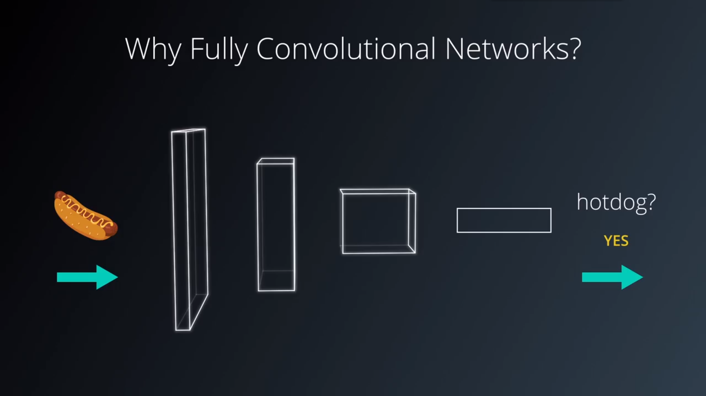

But what if we want to change our task ever so slightly. We want to answer the question, "Where's the hotdog in the picture?". The question is much more difficult to answer since fully connected layers don't preserve spatial information.
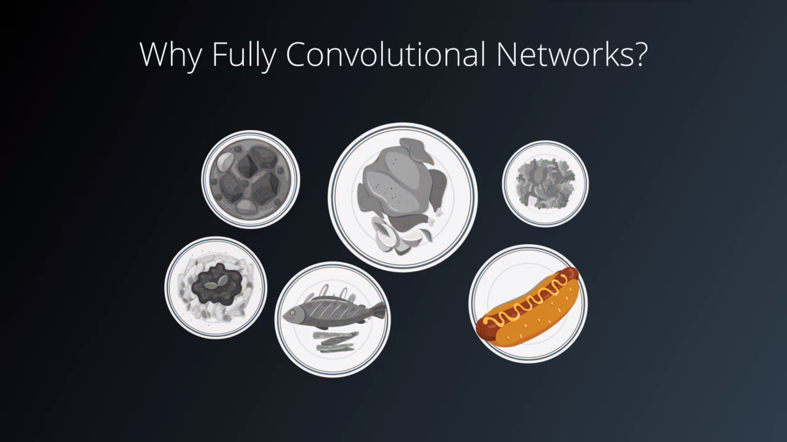

But turns out, if you change from connected to convolutional, we can integrate convolutions directly into the layer to create fully convolutional networks or FCNs for short. FCNs help us answer where's the hotdog question, because while doing the convolution they preserve the spatial information throughout the entire network.
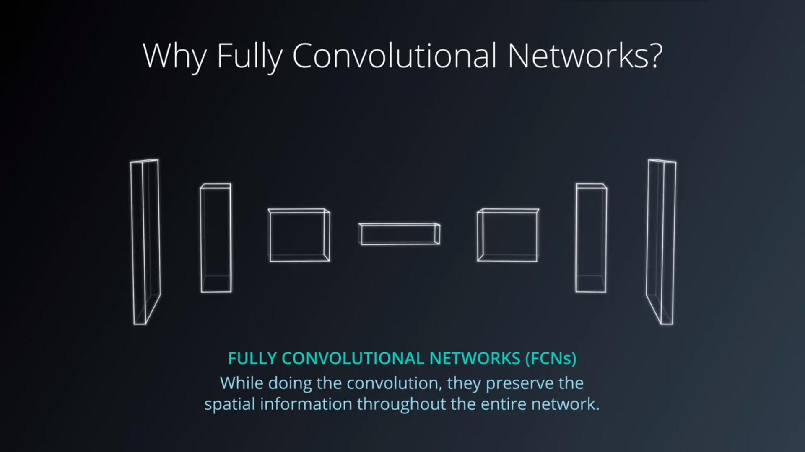

Additionally, since convolutional operations don't care about the size of the input, a FCN will work on images of any size. In a classic CNN with fully connected final layers, the size of the input is constrained by the size of the fully connected layers. Passing different size images through the same sequence of convolutional layers and flattening the final output. These output will be of different sizes, which doesn't bode very well for matrix multiplication.
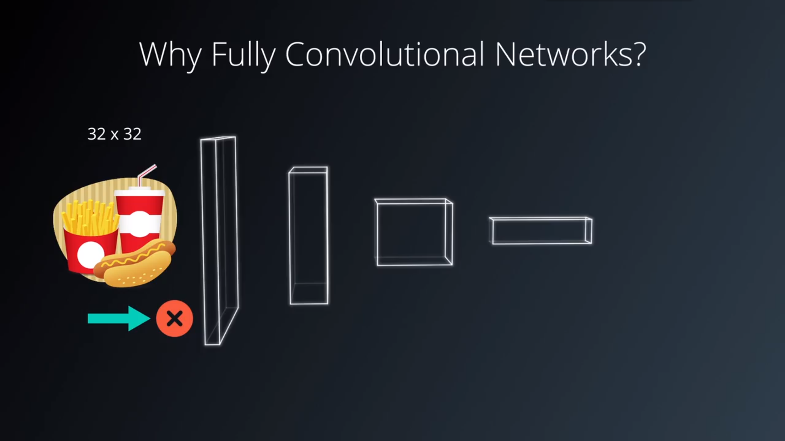

#### *Fully Convolutional Networks*

FCNs have achieved state of the art results in computer vision tasks, such as semantic segmentation. FCNs take advantage of three special techniques:

* replace fully connected layers with 1x1 convolutional layers

* un-sampling through the use of transposed convolutional layers

* skip connections that allow the network to use information from multiple resolution scales

Structurally, a FCN is usually comprised of two parts, an encoder and a decoder. The encoder is a series of convolutional layers like VGG or ResNet. The goal of it is to extract features from the image. The decoder up-scales the output of the encoder such that it's the same size of the original image. Thus, it results in segmentation or prediction of each individual pixel in the original image.
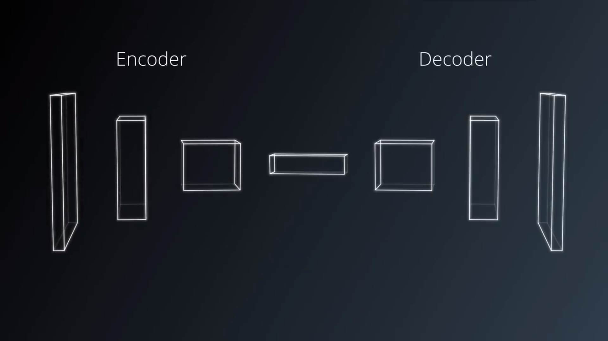

#### *Fully Connected to 1x1 Convolution*

Replacing the fully connected layer with 1x1 convolutional layers will result in the output tensor value will remain 4D instead of flattening to 2D, so spatial information will be preserved.
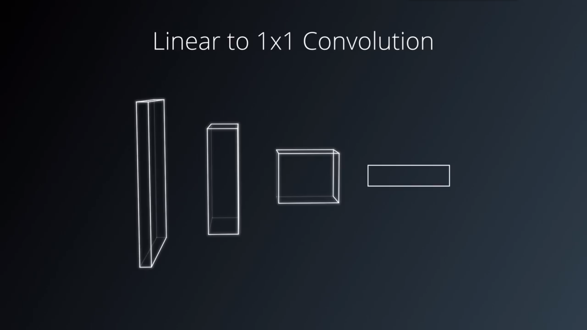

Recall the output of the convolutional operation is the result of sweeping the kernel over the input with the sliding window and performing element wise multiplication and summation. One way to think about this is the number of kernels is equivalent to the number of outputs in a fully connected layer. Similarly, the number of weights in each kernel is equivalent to the number of inputs in the fully connected layer. Effectively, this turns convolutions into a matrix multiplication with spatial information.
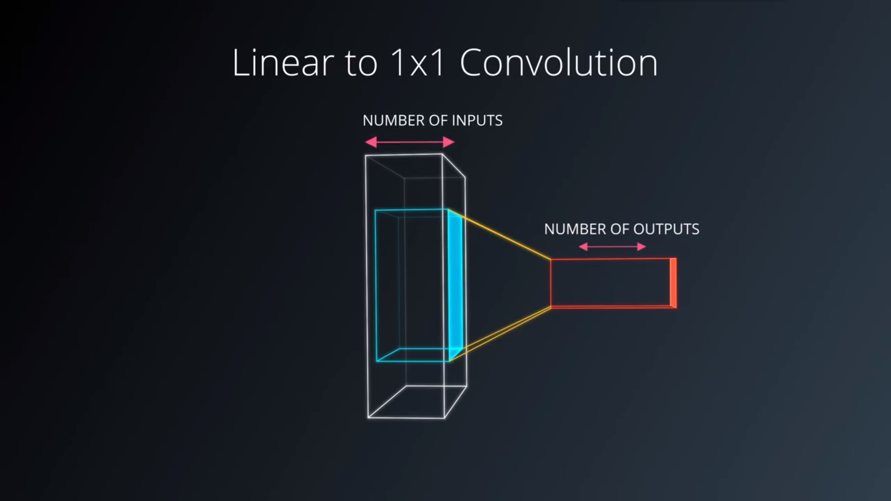

Here’s an example of going from a fully-connected layer to a 1-by-1 convolution in TensorFlow:

```python
num_classes = 2
output = tf.layers.dense(input, num_classes)
```

To:

```python
num_classes = 2
output = tf.layers.conv2d(input, num_classes, kernelsize=(1,1), strides=(1,1))
```

#### *Transposed Convolutions*

Now using the second special technique, we can create decoder of FCNs by Transposed Convolution. A transposed convolution is essentially a reverse convolution in which the forward and the backward passes are swapped. Hense, we call it transpose convolution, some calls it deconvolution as well because it undoes the previous convolution. Since all we are doing is swapping the order of forward and backward passes, the math is actually the same as what we've done earlier. The derivative of the output width is just the same of convolution input: `W_out = S*(W-1)−2P+K`
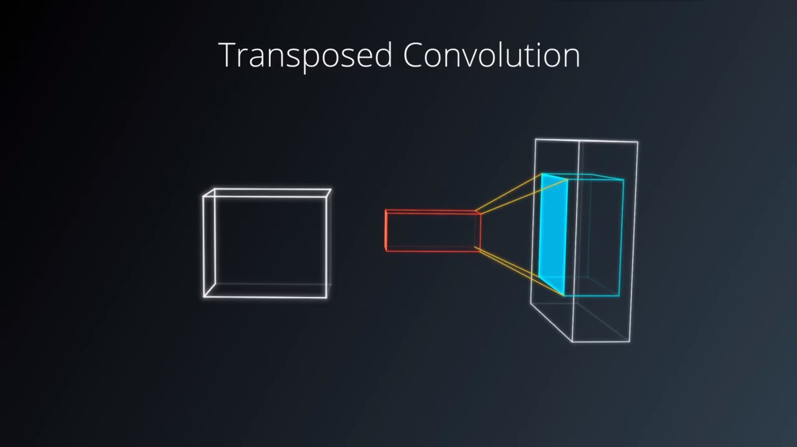

Transposed Convolutions help in upsampling the previous layer to a higher resolution or dimension. Upsampling is a classic signal processing technique which is often accompanied by interpolation. We can use a transposed convolution to transfer patches of data onto a sparse matrix, then we can fill the sparse area of the matrix based on the transferred information. However, the upsampling part of the process is defined by the strides and the padding. If we have a 2x2 input and a 3x3 kernel; with "SAME" padding, and a stride of 2 we can expect an output of dimension 4x4. The following image gives an idea of the process.
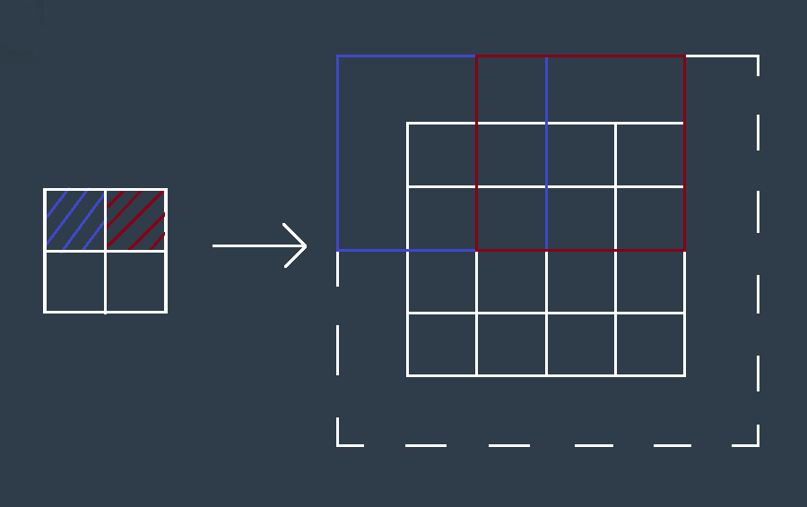

Let's implement transposed convolutions as follows:

```python
output = tf.layers.conv2d_transpose(input, num_classes, 4, strides=(2, 2))
```

#### *Skip Connections*

In practice, one effect of convolutions or encoding in general is we narrow down the scope by looking closely at some picture and lose the bigger picture as a result. So even if we were to decode the output of the encoder back to the original image size, some information has been lost.
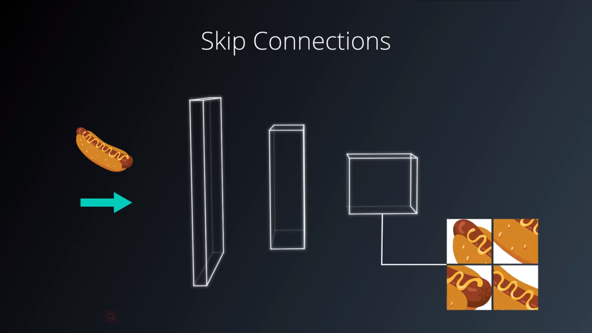

Skip Connections are a way of retaining the information easily. The way skip connection work is by connecting the output of one layer to a non-adjacent layer. Here the output of the pooling layer from the encoders combine with the current layers output using the element-wise addition operation. The result is bent into the next layer. These skip connections allow the network to use information from multiple resolutions. As a result, the network is able to make more precise segmentation decisions.
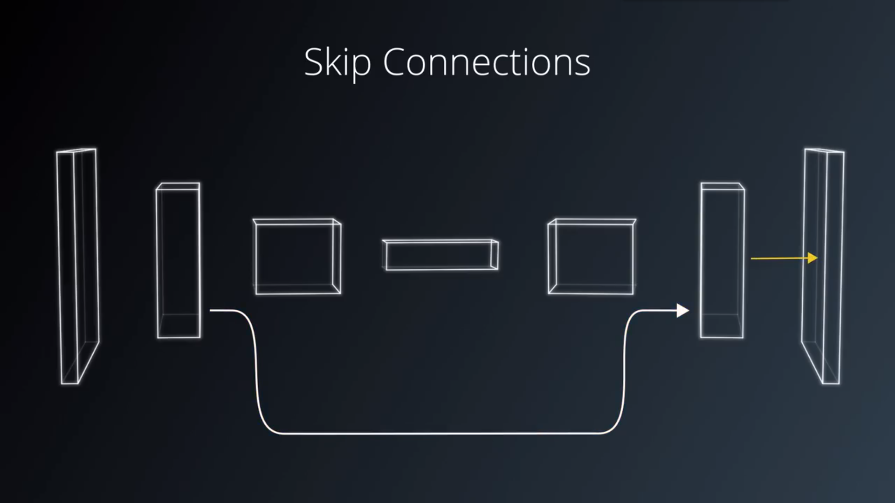

This is empirically shown in the following comparison between the FCN-8 architecture which has two skip connections and the FCN-32 architecture which has zero skip connections.
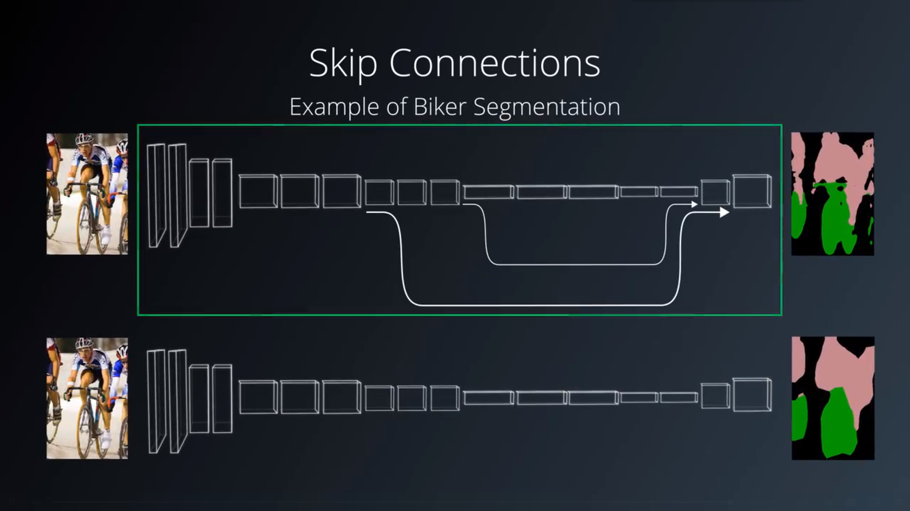

In the following example we combine the result of the previous layer with the result of the 4th pooling layer through elementwise addition (tf.add).

```python
# make sure the shapes are the same!
input = tf.add(input, pool_4)
```

We can then follow this with another transposed convolution layer.

```python
input = tf.layers.conv2d_transpose(input, num_classes, 4, strides=(2, 2))
```

We then repeat this once more with the third pooling layer output.

```python
input = tf.add(input, pool_3)
Input = tf.layers.conv2d_transpose(input, num_classes, 16, strides=(8, 8))
```

#### *Classification & Loss*

Like what we do in CNNs, classification & loss part is also necessary for evaluation. In the case of a FCN, the goal is to assign each pixel to the appropriate class. We already happen to know a great loss function for this setup, cross entropy loss! Remember the output tensor is 4D so we have to reshape it to 2D:

```python
...
logits = tf.reshape(input, (-1, num_classes))
```

`logits` is now a 2D tensor where each row represents a pixel and each column a class. From here we can just use standard cross entropy loss:

```python
cross_entropy_loss = tf.reduce_mean(tf.nn.softmax_cross_entropy_with_logits(logits, labels))
```

#### *FCNs In The Wild*

A FCN has two components, the encoder and the decoder. We mentioned that the encoder extract features that will be used later by the decoder, which is quite similar to Transfer Learning. In fact we can borrow the technique of transfer learning to accelerate the training of our FCN. It's common for a encoder to be pre-trained on ImageNet and VGG or ResNet are popular choices.

Later by applying the first special technique of one by one convolutional layer conversion, we can complete the encoder portion of the FCN.

The encoder is followed by decoder, which uses the second special technique of transpose convolutional layers to upsample the image.

Then the skip connection via the third special technique is added. Be careful not to add too many skip connections though. It can lead to the explosion in the size of our model. For example, when using VGG-16 as the encoder, only the third and fourth pooling layers are typically used for skip connections.

After all above, we can now train the model end to end.
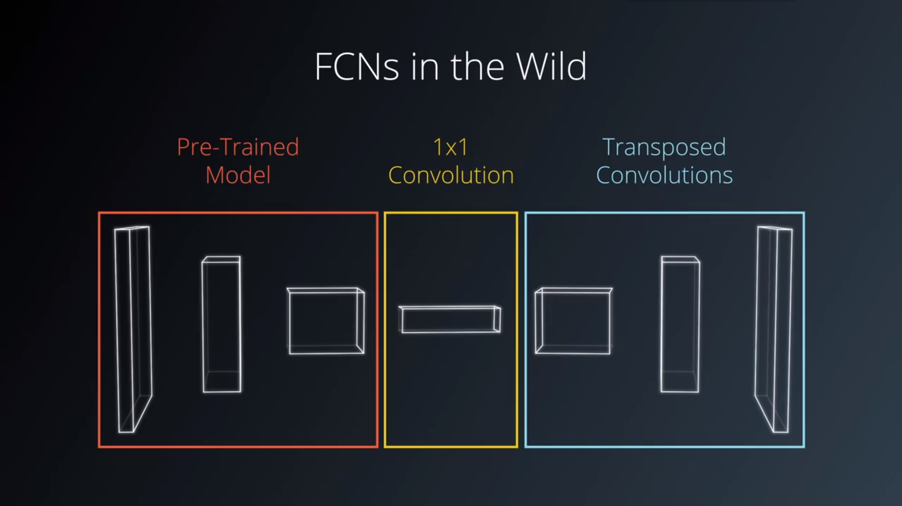

#### *Scene Understanding*

To understand a particular scene, we have to extract features from an image, including object detection, and semantic segmentation which mainly applies FCNs.

#### *Bounding Boxes*

Our first task is object detection, and we can use bounding boxes for that. This is a simpler method of scene understanding compared to segmentation. In neural networks, we just need to figure out where an object is and draw a type box around it. There are already great open source state of the art solutions, such as YOLO and SSD models. These models perform extremely well even at high frame per second(FPS). They are useful for detecting different objects such as cars, people, traffic lights, and other objects in the scene.
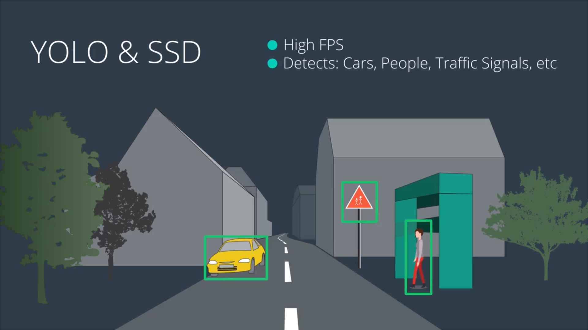

However, bounding boxes have their limits. When drawing around a curvy road, the forest, or the sky, it quickly becomes problematic or even impossible to convey the true shape of an object. At best, bounding boxes can only hope to achieve partial seen understanding.
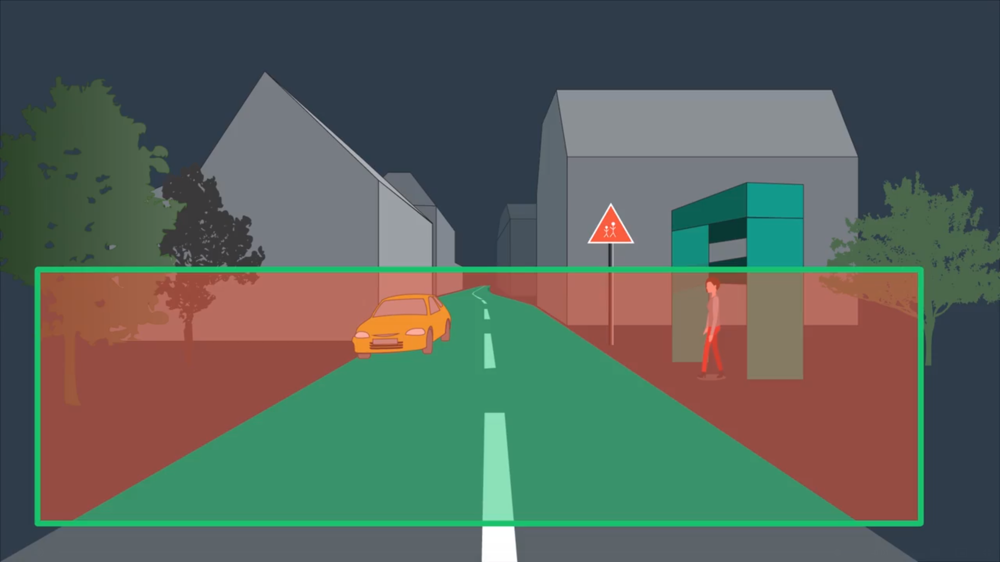

#### *Semantic Segmentation*

Semantic segmentation is the task of assigning meaning to part of an object. This can be done at the pixel level where we assign each pixel to a target class such as road, car, pedestrian, sign or any number of other classes. Semantic segmentation help us derive valuable information about every pixel in the image rather than just slicing sections into bounding boxes.
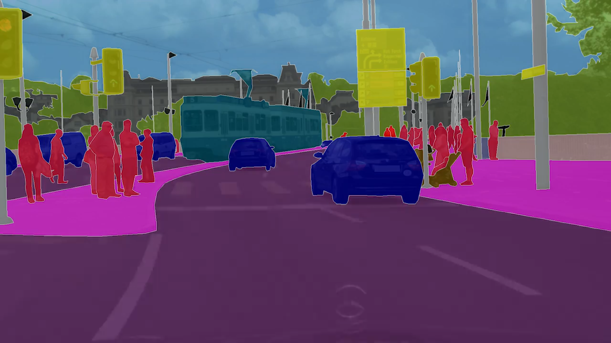

#### *IoU*

IoU represents Intersection over Union Metric, commenly used to measure the performance of a model on the semantic segmentation task. It's a amount of the intersection set divided by the union set.
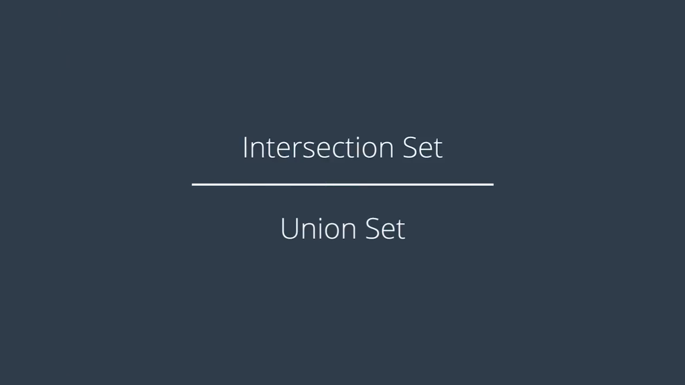

Intersection of two sets is just an AND operation. If one exists in both sets, we then put it into the intersection set. For each class, the intersection is defined as the number of pixels that both truly part of the class and are classified as part of that class by the network.
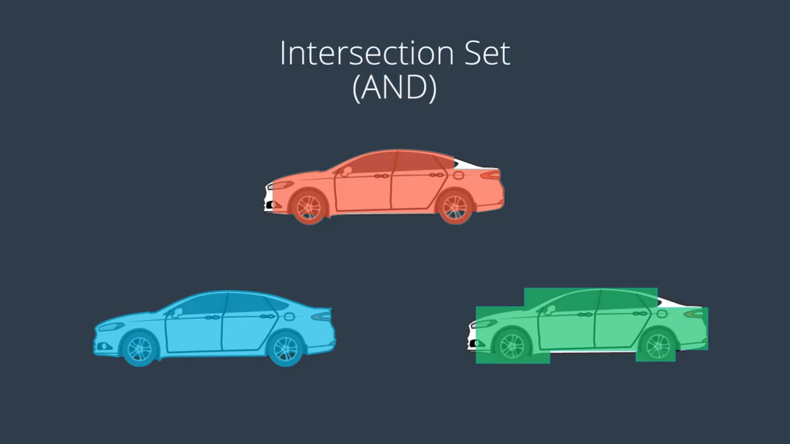

Union of two sets is a OR operation. If one exists in at least one of the two sets, then we put it into the union set. The union is defined as the number of pixels that are truly part of that plus the number of pixels that are classified as part of that class by the network.
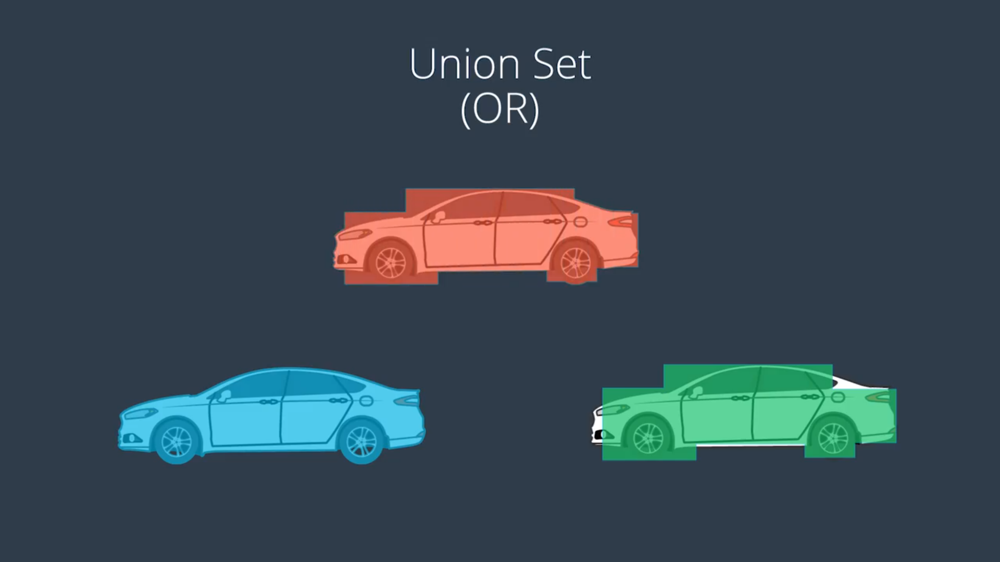

So it's obvious that the intersection set is always smaller or equal to the union set, the ratio should always less or equal to one, which referred to be IoU. IoU tells us the overall performance per pixel, per class. By taking average of all the IoUs for all the classes, we can calculate the mean IoU of our network, which gives us an idea of how well it handles all the different classifications for every single pixel.
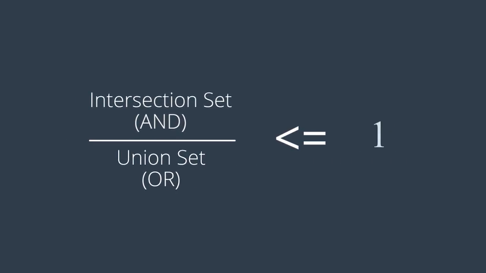
