# *Udacity Self-driving Nanodegree*

## Reflection on Kalman Filters

#### *Tracking Intro*

In this part, we will introduce an insanely popular technique for estimating the state of a system, that is called a Kalman Filter. It estimate a continuous state and as a result, the kalman filter gives us a uni-modal distribution.

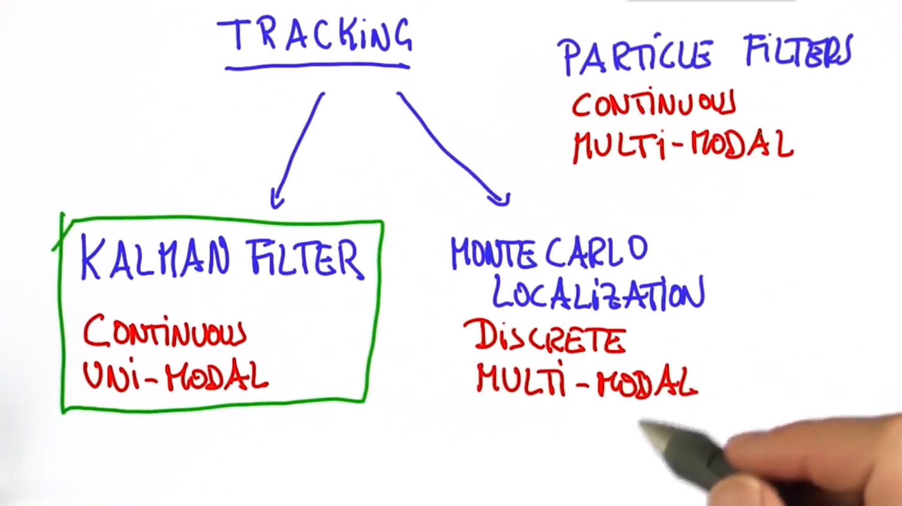

#### *Gaussian*

In Kalman Filters, the distribution is given by what is called a Gaussian. Gaussian is a continuous function over the space of locations and the area underneath sums up to one.

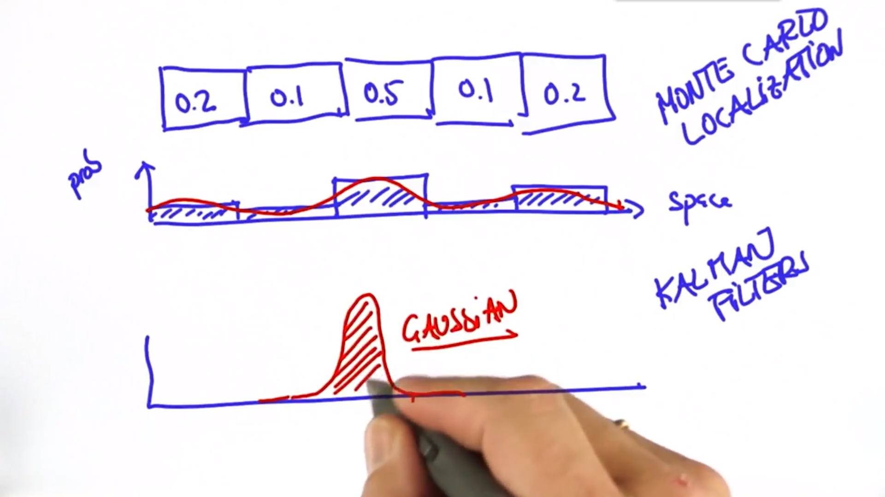

So here's our Gaussian and if we call the sapce X then the Gaussian can be characterized by two parameters. The mean, often abbreviated with the Greek letter *μ*, and the width of the Gaussian, often called the variance written as a quadratic variable, *σ^2*. So any Guassian in 1-D, which means the parameter space is one dimensional, is characterized by those two, and our task in Kalman Filters is to maintain a *μ* and *σ^2* as our best estimate of the option location we are trying to find. The exact formula is an exponential of a quadratic function after a normalization.

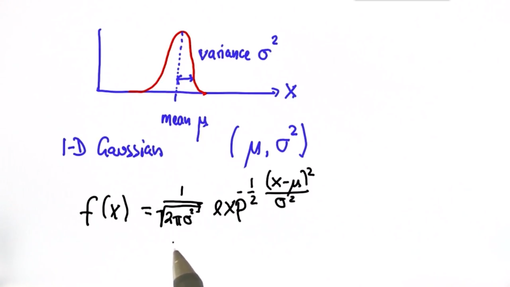

#### *Measurement and Motion*

The Kalman Filter represents our distributions by Gaussians and iterates on two main cycles.
**The first cycle is the Measurement Update.**

* Requires a product
* Uses Bayes rule.

Measurements will lead into something called Bayes Rule. It's the most fundamental consideration in probabilistic inference, but the basic rule is really really simple. Suppose a location X and a measurement Z, then the measurement update seeks to calculate a belief over my location after seeing the measurement.

We compute as follow: first takes in our **prior distribution**, P(X), and multiplies in the chances of seeing a reference substance for every possible location, P(Z|X), which is large if the measurement corresponded to the correct prediction. In this way, it comes out the non-normalized posterior distribution, and the normalization is now a constant over here, P(Z), which technically is the probability of seeing a measurement devoid of any location information. In practice, P(Z) is just the sum of over all i of the product above.

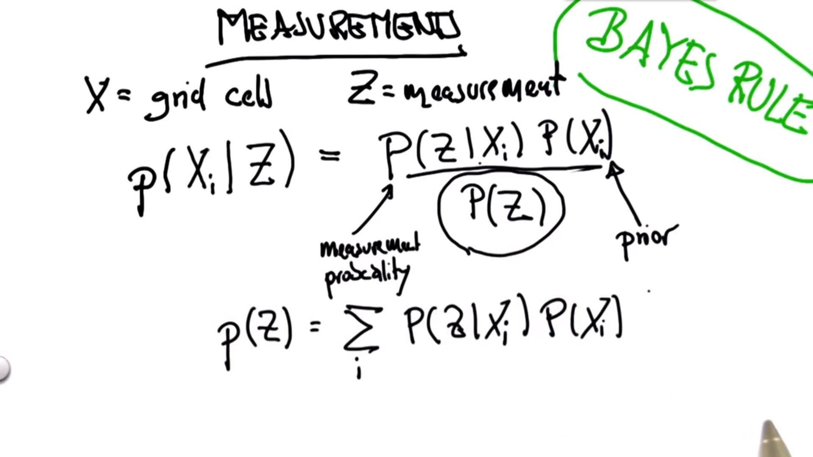

**The second cycle is the Motion Update.**

* Involves a convolution
* Uses total probability.

Let's illustrate total probability in a 1-D situation. Assuming our robot has no clue where it is, we can model this with a function where the horizontal axis corresponds to all the places in this world and the vertical axis is the probability for that location.

At the very beginning, we only have a distribution by a uniform function that assigns equal weights to every possible place in this world. This is the state of maximum confusion and to localize the world has to have some distinctive features, which in this case are the three green doors. The measurement of the door transform our belief function defined over possible locations, to the middle one. This is called the **posterior belif** meaning it is after a measurement has been taken. Then let's assume the robot moves, and we simply shift the belief according to the motion, which makes our belief function looks like the third one. But since the motion is somewhat uncertain, the bumps will be a little flatter than the above. The process of moving the beliefs is technically called a convolution. Suppose we move a small step right and do a measurement seeing a door again, the belief function will then be like the bottom one, only one door in the prior that really corresponds to the current measurement and we have one large bump here. At this point, our robot has localized itself.

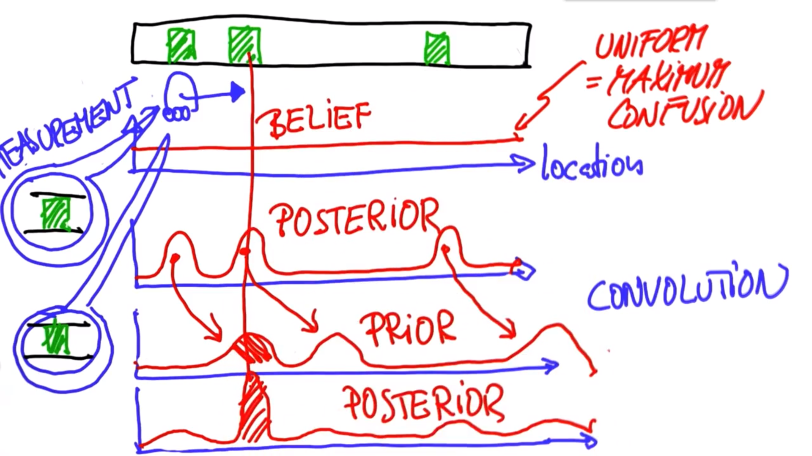

#### *Kalman Filters*

In Kalman Filters, we iterate measurement and motion, which can also be called `measurement update` and `prediction`. In the `measurement update` we'll use Bayes Rule, which is nothing else but a product or a multiplication. As for `prediction`, we use Total Probability which is a convolution or simply an addition. A most important basic supposition is that, both the measurement cycle and the prediction cycle are discussed under **Gaussian distribution**.

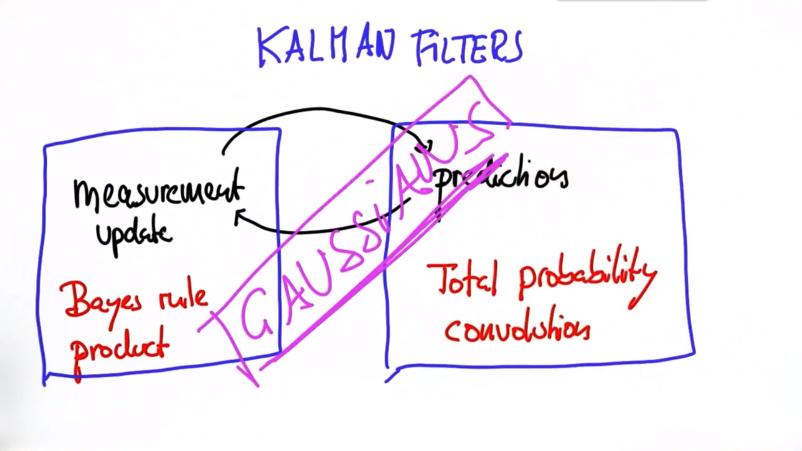

#### *Measurement Update*

Suppose we multiply two Gaussians as in Bayes rule, a prior and a measurement probability. Then the new mean and new variance can be updated by them. So this is the measurement update step in Kalman Filter and the posterior might look like below.

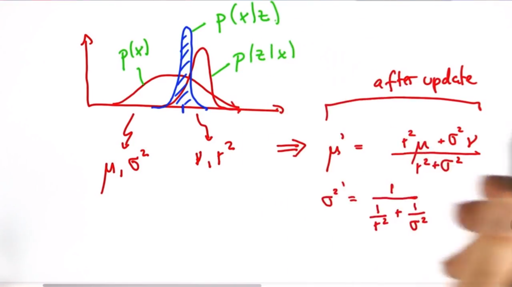

#### *Motion Update (Prediction)*

Suppose we have a Gaussian represents our current location, and now we move to the right side with a certain distance. This motion itself has its own set of uncertainty. Then we arrive at a prediction that adds the motion of command to the mean, and it has an increased uncertainty over the initial uncertainty. Intuitively this makes sense. If we move to the right by this distance, in expection we are exactly where we wish to be, but we lost information because our motion is not precise as manifested by the uncertainty. The update here is simply an addition and this is what we do in the prediction cycle of Kalman Filter.

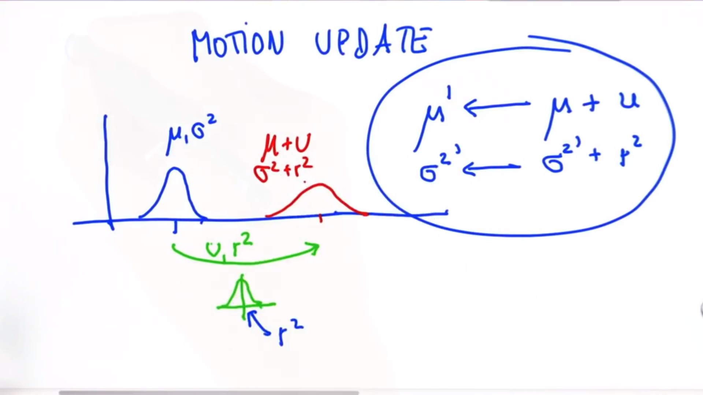

#### *Higher Dimensions*

One of the most amazing things about Kalman Filters in tracking applications is that, even though we can only measure locations, it's able to figure out the object velocity and make predictions about future locations from it.

To explain how this works, we must talk about high dimensional Gaussians, or Multivariate Gaussians. The mean is now a vector with one element for each of the variance. The variance here is replaced by what's called a co-variance, and it's a matrix with D rows and D columns, if the dimensionality of the estimate is D.

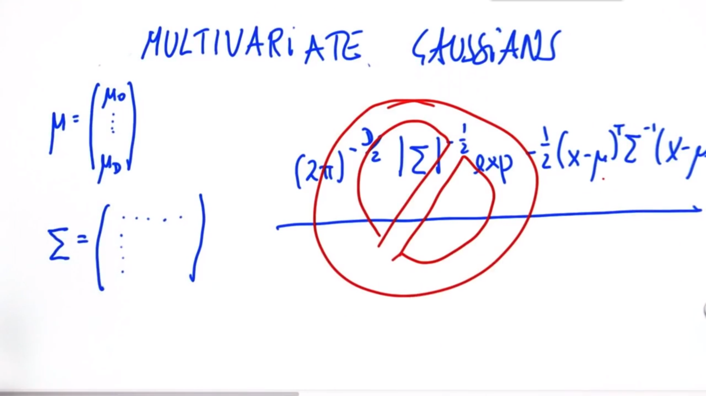

Here's a 2-dimensional space, and we can draw the counter lines of a 2D Gaussian on it. The mean is at (x0, y0), and the co-variance now defines the spread of the Gaussian, as indicated by these contour lines. A Gaussian can have a small amount of uncertainty in one direction but a huge uncertainty in the other. But when a Gaussian is tilted as shown, the uncertainty of x and y is correlated.

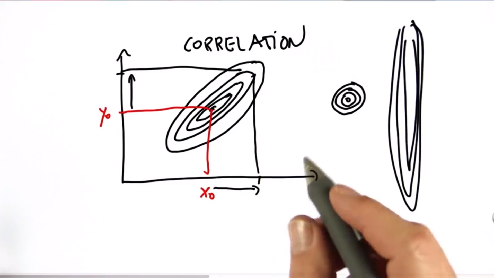

Thus we can update our model to 2D as below:

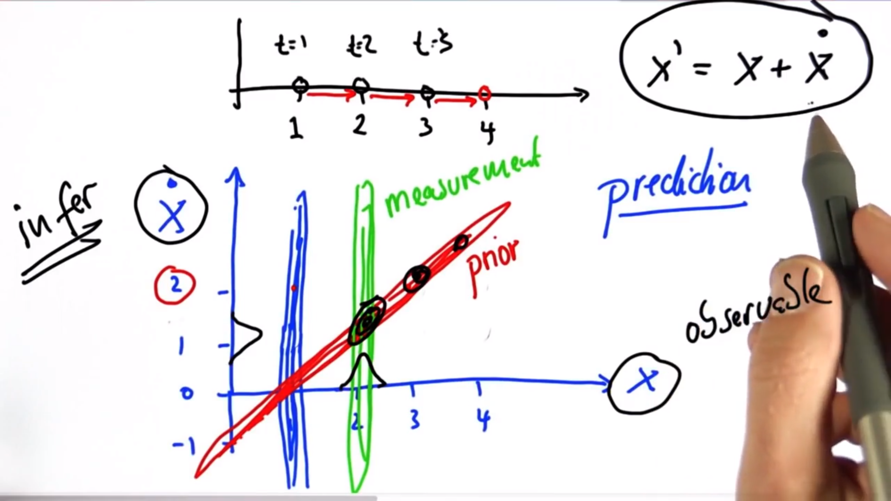

#### *Kalman Filter Design*

When we design a Kalman Filter, we need effectively 2 things. For the state, we need a state transition function, that's usually a matrix. For the measurements, we also need a measurement function. Take our 1-D motion as an example. We can easily express its state as follow. For measurement, we only observe the first component of place, not velocity.

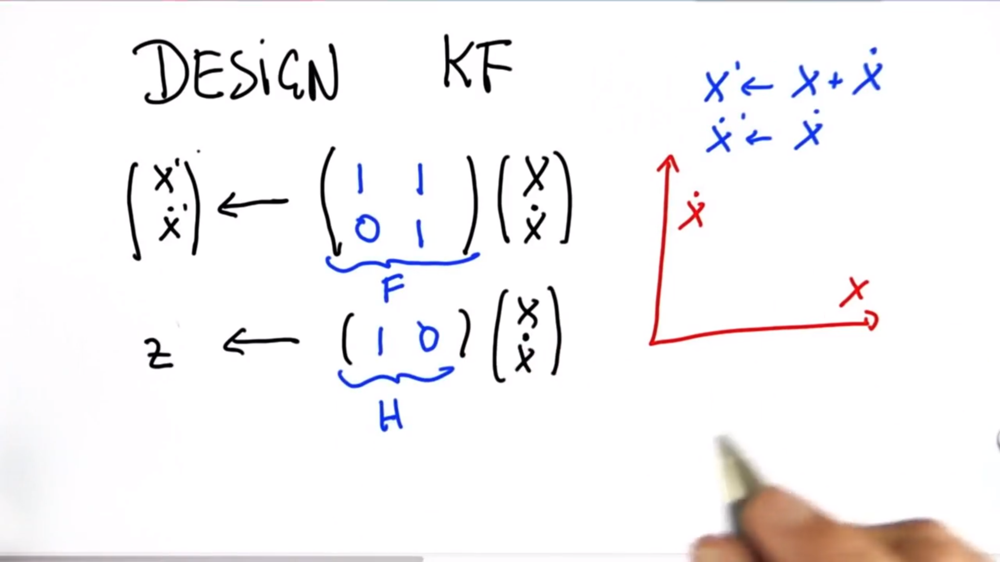

The update equations are a little complicated, and we don't need to memorize it.

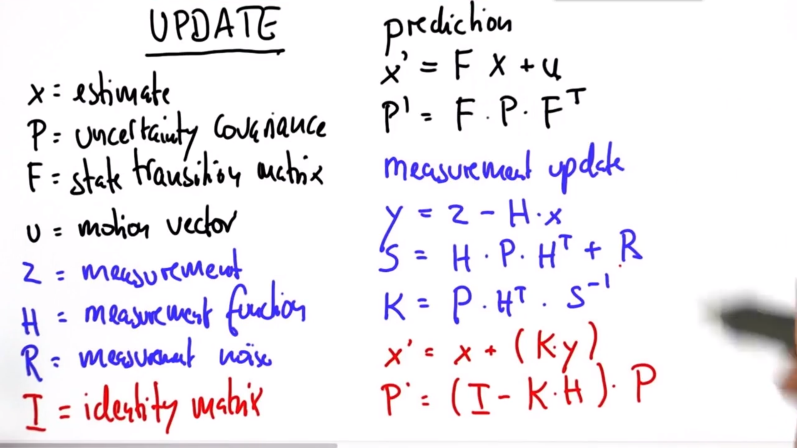