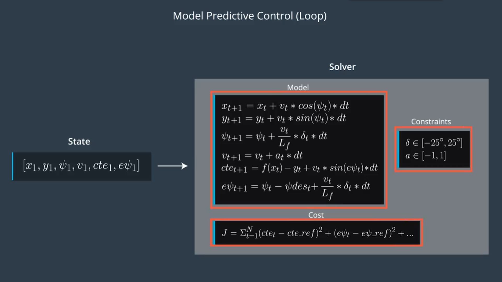

# *Udacity Self-driving Nanodegree*

## Reflection on Model Predictive Control

#### *Intro*

Model Predictive Control reframes the task of following a trajectory as an optimization problem. The solution to the optimization problem is the optimal trajectory. MPC involves simulating different actuator inputs, predicting the resulting trajectory and selecting that trajectory with a minimum cost.

Let's look at one step in the process. Imagine that we know our current state and the reference trajectory we want to follow. We optimize our actuator inputs at each step in time in order to minimize the cost of our predicted trajectory. Once we found the lowest cost trajectory, we implement the very first set of actuation commands and throw away the rest of the trajectory we calculated. Instead of using the old trajectory we predicted, we take our new state and use that to calculate a new optional trajectory. In that sense, we are constantly calculating inputs over a future horizon. That's why this approach sometimes also called Receding Horizon Control.

Why we don't carry out the entire trajectory we calculated during the first pass? The reason is that our model is only approximate. Despite our best efforts, it won't match the real world exactly. Once we perform our actuation command, our trajectory might not be exactly the same as the trajectory we predicted. So it's crucial that we constantly re-evaluate to find the optimal actuations.

#### *Build a Kinematic Model*

Like before, the state could be a vector $[x, y, \psi, v]$. But here we take the additional control inputs $[\delta, a]$ into consideration:


For $x$ and $y$ we can easily update them by:

$$x_{t+1} = x_t + v_t*cos\psi_t*dt$$

$$y_{t+1} = y_t + v_t*sin\psi_t*dt$$

Next, let's turn our attention to $\psi$. Considering the bicycle model of a car, we have:

$$\omega = \frac{d\psi}{dt}$$

$$\omega = \frac{v}{R} = \frac{vtan\delta}{L_f}$$

Thus we can easily update it:

$$\psi_{t+1} = \psi_t + \frac{v_t}{L_f}*\delta_t*dt$$

Here $L_f$ measures the distance between the center of mass of the vehicle and it's front axle. The larger the vehicle, the slower the turn rate.

Finally, let's take a look at how the velocity, $v$ is modeled:

$$v_{t+1} = v_t + a_t * dt$$

Awesome! We've now defined the state, actuators and how the state changes over time based on the previous state and current actuator inputs.

#### *Error*

A controller actuates the vehicle to follow the reference trajectory within a set of design requirements. One important requirement is to minimize the area between the reference trajectory and the vehicle's actual path. We can minimize this error by predicting the vehicle's actual path and the adjusting the control inputs to minimize the difference between that prediction and the reference trajectory. That's how to use a kinematic model to predict the vehicle's future state.


Next, we'll define the predicted area between the trajectory and that predicted path of the vehicle. Once we've predicted the error, we can actuate with the vehicle to minimize the error over time.


We can capture how the errors we are interested in change over time by deriving our kinematic model around these errors as our new state vector. So the new state becomes $[x, y, \psi, v, cte, e\psi]$. Let’s assume the vehicle is traveling down a straight road and the longitudinal direction is the same as the x-axis.


**Cross Track Error**
Now we can express the error between the center of the road and the vehicle's position as the cross track error (CTE). The CTE of the successor state after time t is the state at t + 1, and is defined as:

$$cte_{t+1} = cte_t + v_t*sin(e\psi_t)*dt$$

In this case $cte_t$ can be expressed as the difference between the line and the current vehicle position y. Assuming the reference line is a 1st order polynomial $f$, $f(x_t)$ is our reference line and our CTE at the current state is defined as:

$$cte_t = f(x_t) - y_t$$

If we substitute $cte_t$ back into the original equation the result is:

$$cte_{t+1} = f(x_t) - y_t + v_t*sin(e\psi t)*dt$$

This can be broken up into two parts:

1. $f(x_t) - y_t$ being current cross track error.
2. $v_t * sin(e\psi_t) * dt$ being the change in error caused by the vehicle's movement.

**Orientation Error**
Ok, now let’s take a look at the orientation error:

$$e\psi_{t+1} = e\psi_t + \frac{v_t}{L_f}*\delta_t*dt$$

The update rule is essentially the same as $\psi$. $e\psi_t$ is the desired orientation subtracted from the current orientation:

$$e\psi_t = \psi_t - \psi{des}_t$$

We already know $\psi_t$, because it’s part of our state. But we don’t yet know $\psi{des}_t$(desired psi) - all we have so far is a polynomial to follow.

However, $\psi{des}_t$ can be calculated as the tangential angle of the polynomial $f$ evaluated at $x_t$, $arctan(f'(x_t))$. $f'$ is the derivative of the polynomial.

$$e\psi_{t+1} = \psi_t - arctan(f'(x_t)) + \frac{v_t}{L_f}*\delta_t*dt$$

Similarly to the cross track error this can be interpreted as two parts:

1. $\psi_t - arctan(f'(x_t))$ being current orientation error.
2. $\frac{v_t}{ L_f}*\delta_t*dt$ being the change in error caused by the vehicle's movement.


#### *Reference State*

A good start to the cost function is to think of the error that you would like to minimize. For example, measuring the offset from the center of the lane, where the center of the lane can be called the reference, or desired, state.

So far, we captured two errors in our state vector: $cte$ and $e\psi$.

Ideally, both of these errors would be 0 - there would be no difference from the actual vehicle position and heading to the desired position and heading.

Our cost should be a function of how far these errors are from 0.

Here’s one such example of how to increment our cost at each timestep, tt, over our desired time horizon (represented by total number of desired timesteps, NN, below) - we want to minimize the total error accumulated over this time horizon:

```cpp
double cost = 0;
for (int t = 0; t < N; ++t) {
  cost += pow(cte[t], 2);
  cost += pow(epsi[t], 2);
}
```

#### *Designing cost function*

If the goal is to move the vehicle from A to B, then the equations above will probably come to a halt in the middle of the reference trajectory.

A simple solution is a set of reference velocity, the cost function will penalize the vehicle for not maintaining that velocity.


Another option is to measure the Euclidean distance between the current position of the vehicle and the destination before putting it into the cost as well.


Actually, the cost function is not limited to the state, we could also include the control input. The reason we do this is to allow us to penalize the magnitude of the input as well as the change rate. If we want to change lanes, for example, we would have a large cross-tracker that would want to penalize turning the wheel really sharply. This will yield a smoother lane change.

We could add the control input magnitude like this:


And we still need to capture the change rate of the control input to add some temporal smoothness. So this additional term in the cost function captures the difference between the next control input state and the current one so we have further control over the inputs.


#### *Length and Duration*

The prediction horizon is the duration over which future predictions are made. We’ll refer to this as $T$.

$T$ is the product of two other variables, $N$ and $dt$.

$N$ is the number of timesteps in the horizon. $dt$ is how much time elapses between actuations. For example, if $N$ were 20 and $dt$ were 0.5, then $T$ would be 10 seconds.

$N$, $dt$, and $T$ are hyperparameters you will need to tune for each model predictive controller you build. However, there are some general guidelines. $T$ should be as large as possible, while $dt$ should be as small as possible.

These guidelines create tradeoffs.

**Horizon**
In the case of driving a car, T should be a few seconds, at most. Beyond that horizon, the environment will change enough that it won't make sense to predict any further into the future.

**Number of Timesteps**
The goal of Model Predictive Control is to optimize the control inputs: $[\delta, a]$. An optimizer will tune these inputs until a low cost vector of control inputs is found. The length of this vector is determined by $N$:

$$[\delta_1, a_1, \delta_2, a_2, ..., \delta_{N-1}, a_{N-1}]$$

Thus N determines the number of variables optimized by the MPC. This is also the major driver of computational cost.

**Timestep Duration**
MPC attempts to approximate a continuous reference trajectory by means of discrete paths between actuations. Larger values of $dt$ result in less frequent actuations, which makes it harder to accurately approximate a continuous reference trajectory. This is sometimes called "discretization error".

A good approach to setting $N$, $dt$, and $T$ is to first determine a reasonable range for $T$ and then tune $dt$ and $N$ appropriately, keeping the effect of each in mind.


#### *Putting It All Together*

MPC uses an optimizer to find the control inputs and minimize the cost function. We actually only excute the very first set of control inputs. This brings the vehicle into a new state and then we repeat the process.


Here is the MPC algorithm. First, we set up everything required for the MPC loop. This consists of defining the duration of the trajectory $T$, by choosing $N$ and $dt$. Next, we define the vehicle model and constraints such as actual limitations. Finally, we define the cost function. With the setup complete, we begin to state feedback loop.


First, we pass the current state to the model predictive controller. Next, the optimization solver is called. The solver uses the initial state, the model constraints and cost function to return a vector of control inputs that minimize the cost function.




The solver we will use is called IPOPT. We apply the first control input to the vehicle and repeat the loop.


#### *Latency*

In a real car, an actuation command won't execute instantly - there will be a delay as the command propagates through the system. A realistic delay might be on the order of 100 milliseconds.

This is a problem called "latency", and it's a difficult challenge for some controllers - like a PID controller - to overcome. But a Model Predictive Controller can adapt quite well because we can model this latency in the system.

**PID Controller**
PID controllers will calculate the error with respect to the present state, but the actuation will be performed when the vehicle is in a future (and likely different) state. This can sometimes lead to instability.

The PID controller could try to compute a control input based on a future error, but without a vehicle model it's unlikely this will be accurate.

**Model Predictive Control**
A contributing factor to latency is actuator dynamics. For example the time elapsed between when you command a steering angle to when that angle is actually achieved. This could easily be modeled by a simple dynamic system and incorporated into the vehicle model. One approach would be running a simulation using the vehicle model starting from the current state for the duration of the latency. The resulting state from the simulation is the new initial state for MPC.

Thus, MPC can deal with latency much more effectively, by explicitly taking it into account, than a PID controller.

#### *Tuning MPC*

In practice, the result of cross track error graph looks something like this:


$N$ is set to 25 and $dt$ is set to 0.05 for all other graphs in this section unless specified. The simulation is run for 60 iterations.

This graph looks great! We see the cross track error starts at -11 and within a 30-40 steps it's at 0.

Let's take a look at another graph, the steering angle values:


The steering starts out at a min value -25 degrees and then jumps, causing a spike in the graph, to 25 degrees. The second spike from 25 degrees to 0 degrees is more gradual but still sudden.

While this experiment works out fine in our sample program, on an actual road the vehicle would likely steer off the road and possibly crash. It would be a very unpleasant ride at best!

An approach to solving this problem is tuning a part of the cost function affecting steering.

```cpp
for (int t = 0; t < N - 2; ++t) {
  // Tune this part!
  fg[0] += CppAD::pow(vars[delta_start + t + 1] - vars[delta_start + t], 2);
  fg[0] += CppAD::pow(vars[a_start + t + 1] - vars[a_start + t], 2);
}
```

Multiplying that part by a value > 1 will influence the solver into keeping sequential steering values closer together.

```cpp
fg[0] += 100 * CppAD::pow(vars[delta_start + t + 1] - vars[delta_start + t], 2);
```

result in:


```cpp
fg[0] += 500 * CppAD::pow(vars[delta_start + t + 1] - vars[delta_start + t], 2);
```

result in:


As we can see tuning the steering value in the cost function results in a smoother steering transitions.

In general, we want the steering angle values to be smooth. If the vehicle is behaving erratically it's likely there will be spikes in the steering angle value graph and its one indication you should tune the cost function.
