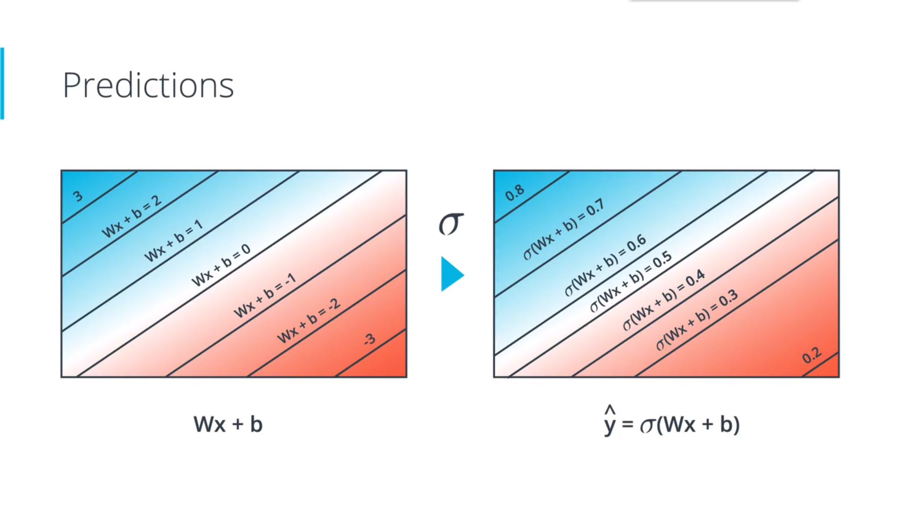
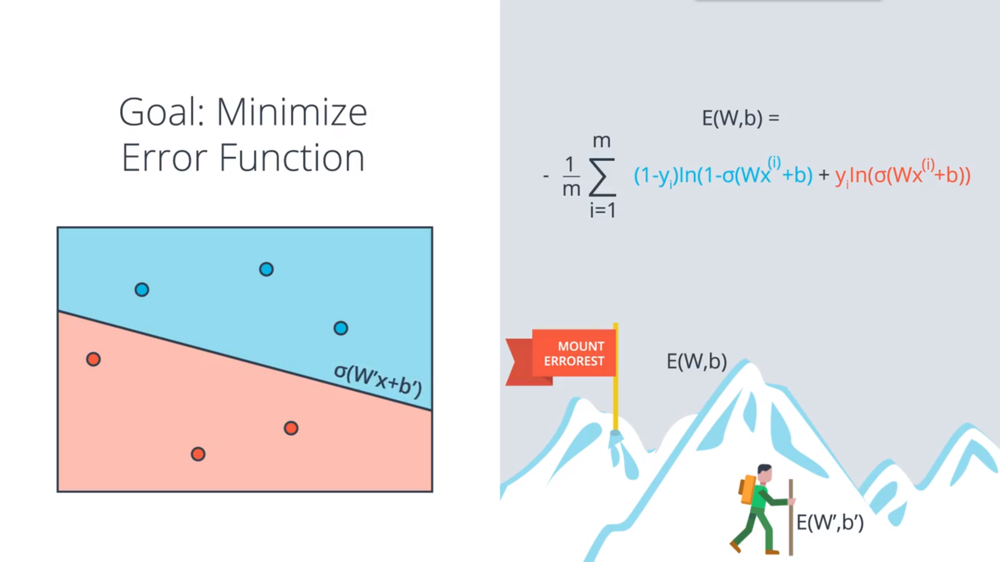

# *Udacity Self-driving Nanodegree*

## Reflection on Neural Networks

#### *From Linear to Logistic Regression*

Linear regression helps predict values on a continuous spectrum, like predicting what the price of a house will be. It leads to logistic regression and ultimately neural networks, a more advanced classification tool.
Classification problems are important for self-driving cars. Self-driving cars might need to classify whether an object crossing the road is a car, pedestrian, and a bicycle. Or they might need to identify which type of traffic sign is coming up, or what a stop light is indicating. Here's an standard classification problem shown below.

#### *Perceptrons*

Data, like test scores and grades, are fed into a network of interconnected nodes. These individual nodes are called perceptrons, or artificial neurons, and they are the basic unit of a neural network. Each one looks at input data and decides how to categorize that data. In the example above, the input either passes a threshold for grades and test scores or doesn't, and so the two categories are: yes (passed the threshold) and no (didn't pass the threshold). These categories then combine to form a decision -- for example, if both nodes produce a "yes" output, then this student gains admission into the university.

When input comes into a perceptron, it gets multiplied by a **weight** value that is assigned to this particular input. For example, the perceptron above has two inputs, test scores and grades, so it has two associated weights that can be adjusted individually. These weights start out as random values, and as the neural network network learns more about what kind of input data leads to a student being accepted into a university, the network adjusts the weights based on any errors in categorization that results from the previous weights. This is called training the neural network.

Finally, the result of the perceptron's summation is turned into an output signal. This is done by feeding the linear combination into an **activation function**. Activation functions are functions that decide, given the inputs into the node, what should be the node's output? Because it's the activation function that decides the actual output, we often refer to the outputs of a layer as its "activations".

#### *Perceptron Algorithm*

Recall that the perceptron step works as follows. For a point with coordinates (p,q), label y, and prediction given by the equation y = step(w1x1 + w2x2 + b)

* If the point is correctly classified, do nothing.

* If the point is classified positive, but it has a negative label, subtract αp, αq, and α from w1, w2, and b respectively.

* If the point is classified negative, but it has a positive label, add αp, αq, and α to w1, w2, and b respectively.

#### *Log-loss Error Function*

We pick up on log-loss error with the gradient descent concept. In order to apply gradient descent, the error function should be continuous and differentiable. Under a certain circumstances, the penalty is roughly the distance from the boundary when the point is misclassified and almost 0 when the point is correctly classfied. Thus we can add up the error of each point and check if the sum has decreased every time we make very small changes to the parameters of the line. The error function formula can vary from different style, one of the most popular form is the Cross-Entropy, it will be discussed later.

#### *Continuous Predictions*

Now that when it comes to optimizing, continuous error functions are better than discrete error functions.

To do this, we need to switch from discrete to continuous predictions. Instead of making discrete conclusion of just Yes or No, we prefer a number normally between 0 and 1 which considered as probability. The method is simply change the activation function from step function to the sigmoid function.

Thus here are our old & new perceptions. What our new perception does is that it takes the inputs, multiplies them by the weights in the edges and adds the results, then applies the sigmoid function. So instead of returning 1 & 0 like before, it returns values between zero and one. Before, it used to say the student got accepted or not, now it says the probability of the student got accepted is this much.

#### *Multi-class Classification*

By applying a softmax function, we are able to turn different scores into probabilities, no matter it is nagetive or positive. When N = 2, the softmax function is completely the same with the sigmoid function.

#### *One-Hot Coding*

For multi-class classification, the variables we should input the algorithm can not be 0 or 1 or 2, because it would assume the dependencies between the classes we don't have. Instead we come up with one variable for each class. This is called the One-Hot coding.

#### *Maximum Likelihood*

We are always in our quest for an algorithm that will help us pick the best model that separates our data. The best model would more likely be the one that gives the higher probabilities to the events that happened to us. The method is called **maximum likelihood**. What we do is we pick the model that gives the existing labels the highest probability. Thus by maximizing the probability, we can pick the best model.
For models shown below, the way to tell they are good or bad is to calculate the probability of each point being the color it is according to the model. Multiply these probabilities in order to obtain the probabillity of the whole arrangement and then check which model performs better. Noticing that the product of lots of points' probabilities can be really small, so the sum of their nagatives of the logarithms is a good choice, which is called **Cross Entropy**. So now our goal has changed from maximizing the probability to minimizing the cross entropy.

#### *Cross Entropy*

For a two-class case, we can easily calculate the cross entropy by the sum of the nagatives of the logarithms. So it really tells us whether two vectors are similar or different.

For a multi-class case, we have more than two possible situations, but the computing method is quite similar. Here the one-hot coding can make a really good use. Because the y variable represents the prediction of the model, it can only be 0 or 1, thus the sum of j only exist one possible probability, which makes it same as the two-class case when m = 2.

#### *Gradient Descent*

Now that we have the means of cross-entropy, it can be used as the error function of a model. The y-hat is the prediction from the model we choose, which can be replaced by wx+b. So in order to minimize the error function, we just need to take some derivatives and optimize our w and b variables.

The gradient of the error function is precisely the vector formed by the partial derivative of the error function with respect to the weights and the bias. So now we can take a small step in the direction of the negative of the gradient. As before, we don't want a dramatic change, so we introduce a small learning rate α. Now taking a step is exactly the same thing as updating the weights and bias as follows. And this will take us to a prediction with a lower error function and the prediction we have now with new w' and b' is better than the one old one with w and b.

***Perceptron vs Gradient Descent***
In fact, these two algorithm are exactly the same thing for those misclassified points, as is shown below. However, the only difference may be that, if a point is correctly classified, the Perceptron algorithm does nothing, while the Gradient Descent will push the line further away from this point.

#### *Non-Linear Data*

So far we've been dealing with datasets that can be seperated by a line. But in real world we usually need to deal with more complicated datasets that require non-linear boundaries. In this case, we'll create a probability function where the points in the blue region are more likely to be blue and the points in the red region are more likely to be red. The seperating curve consists of a set of points which are equally likely to be blue or red. Everything will be the same except this equation won't be linear and that's where neural networks come to play.

#### *Neural Network Architecture*

To create a non-linear model is very simple. We just need to combine two linear models into a non-linear model. For a point in space, we can get probabilities from each linear model and we can simply sum them up before applying a sigmoid function to turn it between 0 and 1.

Similarly, we can add weights on each model to adjust their influence on the non-linear model, and we can even add a bias if we want. Before we have a line that is a linear combination of the input values times the weights plus a bias. Now we have this model is a linear combination of the two previous model times the weights plus some bias. In other words, it's just the linear combination of the two linear models before. By keep doing this, we can always obtain more complex models out of linear combinations of the existing ones. This is what we're going to do to build our neural networks.

#### *Backpropagation*

Now, we're ready to get our hands into training a neural network. For this, we'll use the method known as backpropagation. In a nutshell, backpropagation will consist of:

* Doing a feedforward operation.
* Comparing the output of the model with the desired output.
* Calculating the error.
* Running the feedforward operation backwards (backpropagation) to spread the error to each of the weights on every layer.
* Use this to update the weights, and get a better model.
* Continue this until we have a model that is good.

By using the chain rule, we can calculate the error function derivatives respect to each weight. A derivative is the product of all the partial derivatives. It's worth saying that the sigmoid function has a really good derivative as is shown below.

