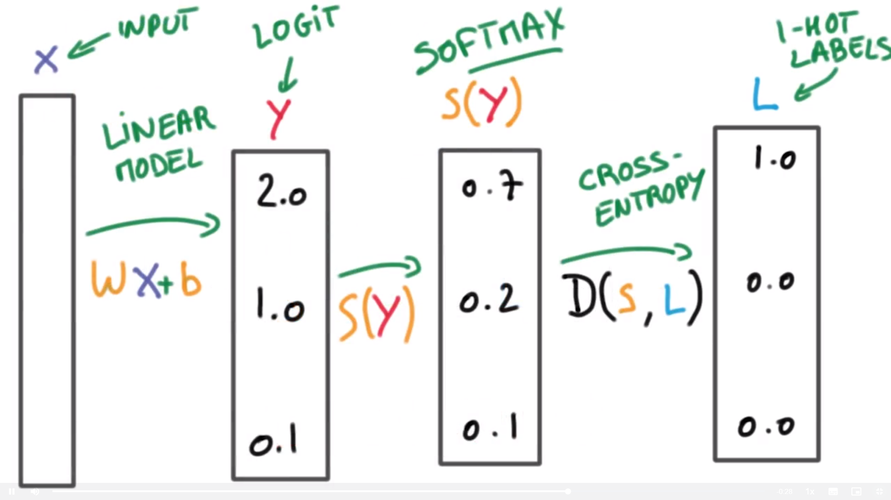

# *Udacity Self-driving Project*

## Reflection on TensorFlow

#### *Logistic Classifier*

A logistic classifier is what we call the linear classifier. It takes the input, for example, the pixels in an image, and applies a linear function to them to generate its predictions. A linear function is just a giant matrix multiplier to get some scores. These scores are often called logits in *Logistic Regression*.


To turn these scores into probabilities, we can use a softmax function. Which was denoted here by S. It can take any kind of scores and turn them into proper probabilities. The probabilities sum to 1 and they will be large when the scores are large, small when the scores are comparatively small.


#### *Transposition*

Our linear function can be: `y = Wx + b`, as is shown below when the variables are all matrixes.


But there's another function that does the same thing, `y = xW + b`. These functions do the same thing and are interchangeable, except for the dimensions of the matrices involved. To shift from one function to the other, you simply have to swap the row and column dimensions of each matrix. This is called transposition. For the rest of this reflect, we will use `y = xW + b`, because this is what TensorFlow uses.


#### *Linear Update*

You can’t train a neural network on a single sample. Let’s apply n samples of x to the function `y = Wx + b`, which becomes `Y = WX + B`. For every sample of X (X1, X2, X3), we get logits for label 1 (Y1) and label 2 (Y2).


In order to add the bias to the product of WX, we had to turn b into a matrix of the same shape. This is a bit unnecessary, since the bias is only two numbers. It should really be a vector.

Here we can take advantage of an operation called broadcasting used in TensorFlow and Numpy. This operation allows arrays of different dimension to be added or multiplied with each other.

```python
import numpy as np
t = np.array([[1, 2, 3], [4, 5, 6], [7, 8, 9], [10, 11, 12]])
u = np.array([1, 2, 3])
print(t + u)

### output
[[ 2  4  6]
 [ 5  7  9]
 [ 8 10 12]
 [11 13 15]]
```

#### *Softmax*

Assigning a probability to each label, you can then use to classify the data. Use the softmax function to turn your logits into probabilities.


#### *One-Hot Encoding*

In order to represent our labels mathematically, we must let the probability of the correct class be close to 1 and all the others be close to 0. So each label will be represented by a vector, 1 for the correct class and 0 everywhere else. This is often called one-hot encoding. Remember, this is just a supposed ideal case for our model to compare with. Exactly the y term in the Cross-Entropy function. What's nice about this approach is that we can now measure how well we're doing by simply comparing two vectors.


#### *Cross-Entropy*
The natural way to measure the distance between those two probability vectors is called the Cross-Entropy. Your labels are one-hot encoded, will have a lot of zeros, which can be optimized by embedding later. For your distribution, the softmax function will ensure every probabilities to be positive, so you can always take a logarithm.


So here we get the whole process of making a Multinomial Logistic Classification, the entire setting is shown below.


#### *Optimization*
The question now is now how we can get good weights and bias that enables our classifier to do what we want it to do. That is, have a low distance for the correct class, but have a high distance for the incorrect class. So we can difine a **training loss**, which is the average cross-entropy over the entire training set. We want all the distances to be small, which means we are doing a good job at classifying every sample in the training data.


There's lots of ways to solve this numerical optimization problem. The simplest way is what we did in machine learning, gradient descent. Take the derivative of our loss, with respect to your parameters, and follow that derivative by taking a step backwards and repeat until we get the bottom.


#### *Input Normalization*
When the computer calculate with too big or too small numbers, it will arise huge error. So one good guiding principle is that we always want our variables to have 0 mean and equal variance whenever possible. A badly conditioned problem means that the optimizer has to do a lot of searching to go and find a good solution. A well conditioned problem makes it a lot easier for the optimizer to do this job.


#### *Weights Initial*
The last thing we wish to have is a good starting point for the gradient descent to proceed. As a simple way, we can draw the weights randomly from a Gaussian distribution with mean 0 and a small standard deviation σ which means the uncertainty to begin with.


#### *Start Training !*
So now we have everything to train this classifier. We've got training data, which is normalized to have zero mean and unit variance. We multiply it by a large matrix, which is initialed with random weights. We apply the softmax and then the cross-entropy loss and we calculate the average of this loss over the entire training data. Then our magical optimization package(like Gradient Descent) computes the derivatives of this loss with respect to the weights and to the biases, and takes a step back in the direction oppesite to that derivative. And then we start all over again, we repeat the process until we reach the minimum of the loss function.


#### *Measuring Performance*

In practice, when we are going to run our classifier on those images and see the performance, it usually only does well on the training set, but when it comes to some test set, it's lost. The problem is that the classifier only memorized the training set and it fails to generalize to new examples. In fact every classifier we build will tend to try and memorize the training set, so we must take a small subset of data and never use them in training, only measure the error on that test data. However, the training of a classifier is usually a process of trial and error. Thus while you tuning on parameters and tweaking the model, the information of the test set has actually leaked to your model, just a tiny bit everytime, but it adds up, and over time, our test data bleeds into our training data. That's why a validation set is necessary.


#### *Validation Set Size*
In the statistic, we have a rule of thumb, a change that affects 30 examples in your validation sets one way or another, is usually statistically significant and typically can be trusted. This is why for most classification tasks, people tend to hold back more than 30000 examples for validation. This makes accuracy figures significant to the first decimal place and gives enough resolution to see small improvements. But if your classes is not well balanced, for example, if some important classes are very rare, this heuristic is no longer good. Still, holding back even 30000 examples can be a lot of data if you only have a small training set, this can be solved by a method called Cross-Validation, but it usually takes a long time. So getting more data is always a better way.


#### *Stochastic Gradient Descent*

After handling with sets, let's go back to training models. Training logistic regression by Gradient Descent is great in **machine learning**, we can directly optimizing the error measure we care about. However in **deep learning**, you will get problems, and the biggest one may be that it's difficult to scale. If computing your loss takes n floating point operations, computing its gradient takes about three times that compute. As our loss function is the average of the Cross-Entropy, this can be a lot of compute when we have a big dataset.


So instead of computing the loss, we're going to compute an estimate of it, a very bad estimate, a terrible estimate, in fact. The estimate we are going to use is simply computing the average loss for a very small random fraction of the training data. Remember if the way we pick our samples isn't random enough, it no longer works at all. So we are going to take a small sliver of the training data and compute their loss and derivatives, and pretend that derivative is the right direction to use for the Gradient Descent. It's not at all the right direction, in fact, it might increase the real loss, not reduce it. But we'll compensate this by doing this many many times while taking very very small steps each time. So each step is a lot cheaper to compute, but we pay the price. We have to take many more smaller steps instead of one large step. But on balance though, we win by a lot. This is called Stochastic Gradient Descent, the core of deep learning, and it's vastly more efficient than doing Gradient Descent. It scales well with both data model size, and we want big data and big models. Always remember that SGD is fundamentally a pretty optimizer which happens to be the only one that fast enough.


#### *Momentum and Learning Rate Decay*

Next we are going to introduce two important tricks to implement SGD. The first one is momentum. Remember at each step, we are talking a very small step in a random direction. We can take advantage of the knowledge that we have accumulated from previous steps about where we should be headed. A cheap way to do this is to keep a running average of the gradients and use that running average instead of the direction of the current. The momentum technique works very well and often leads to better convergence.


The second trick is called Learning Rate Decay. When we replace Gradient Descent with SGD, we must take smaller noisier steps towards our objective. How small should that be? One thing is clear, it's always beneficial to make that step smaller and smaller as you train. Some like to apply an exponential decay to their learning rate. Some like to make it smaller everytime the loss reaches a plateau. There are lots of ways to go about it, but lowering it overtime is the key thing to remember.


#### *Parameter Hyperspace*

Learning rate training can be very strange. A higher learning rate usually does not come along with a good performance. In fact, we can often get a model, lower it learning rate and get a better model faster. What's even worse is that, we temp to look at the curve that shows the loss over time to see how fast the model learns. Here the higher learning rate starts faster but it soon plateaus when the lower learning rate keeps on going and gets better. This is a very familiar picture for anyone who has trained neural networks. **Never trust how quick you learn, it often has little to do with how well you train**.


In fact, we have many hyperparameters to play with and we must get them right. In practice, it's not that bad but one thing you have to remember is that when things don't work, always try to lower your learning rate first. There are lots of good solutions for small models, but none of them are satisfactory for large models we really care about. One approach named ADAGRAD might make things a lot easier. It is a modification of SGD which implicitly does momentum and learning rate decay for us. By using ADAGRAD, we can make our learning less sensitive to hyper-parameters.


#### *Mini-batch*

Mini-batching is a technique for training on subsets of the dataset instead of all the data at one time. This provides the ability to train a model, even if a computer lacks the memory to store the entire dataset.
Mini-batching is computationally inefficient, since you can't calculate the loss simultaneously across all samples. However, this is a small price to pay in order to be able to run the model at all.
It's also quite useful combined with SGD. The idea is to randomly shuffle the data at the start of each epoch, then create the mini-batches. For each mini-batch, you train the network weights with gradient descent. Since these batches are random, you're performing SGD with each batch.

#### *Epochs*

An epoch is a single forward(calculate the loss of our model) and backward(update weights and bias by SGD) pass of the whole dataset. This is used to increase the accuracy of the model without requiring more data.

#### *Implement in TensorFlow*

The following TensorFlow code trains a model using 10 epochs:

```python
from tensorflow.examples.tutorials.mnist import input_data
import tensorflow as tf
import numpy as np
from helper import batches  # Helper function created in Mini-batching section


def print_epoch_stats(epoch_i, sess, last_features, last_labels):
    """
    Print cost and validation accuracy of an epoch
    """
    current_cost = sess.run(
        cost,
        feed_dict={features: last_features, labels: last_labels})
    valid_accuracy = sess.run(
        accuracy,
        feed_dict={features: valid_features, labels: valid_labels})
    print('Epoch: {:<4} - Cost: {:<8.3} Valid Accuracy: {:<5.3}'.format(
        epoch_i,
        current_cost,
        valid_accuracy))

n_input = 784  # MNIST data input (img shape: 28*28)
n_classes = 10  # MNIST total classes (0-9 digits)

# Import MNIST data
mnist = input_data.read_data_sets('/datasets/ud730/mnist', one_hot=True)

# The features are already scaled and the data is shuffled
train_features = mnist.train.images
valid_features = mnist.validation.images
test_features = mnist.test.images

train_labels = mnist.train.labels.astype(np.float32)
valid_labels = mnist.validation.labels.astype(np.float32)
test_labels = mnist.test.labels.astype(np.float32)

# Features and Labels
features = tf.placeholder(tf.float32, [None, n_input])
labels = tf.placeholder(tf.float32, [None, n_classes])

# Weights & bias
weights = tf.Variable(tf.random_normal([n_input, n_classes]))
bias = tf.Variable(tf.random_normal([n_classes]))

# Logits - xW + b
logits = tf.add(tf.matmul(features, weights), bias)

# Define loss and optimizer
learning_rate = tf.placeholder(tf.float32)
cost = tf.reduce_mean(tf.nn.softmax_cross_entropy_with_logits(logits=logits, labels=labels))
optimizer = tf.train.GradientDescentOptimizer(learning_rate=learning_rate).minimize(cost)

# Calculate accuracy
correct_prediction = tf.equal(tf.argmax(logits, 1), tf.argmax(labels, 1))
accuracy = tf.reduce_mean(tf.cast(correct_prediction, tf.float32))

init = tf.global_variables_initializer()

batch_size = 128
epochs = 10
learn_rate = 0.001

train_batches = batches(batch_size, train_features, train_labels)

with tf.Session() as sess:
    sess.run(init)

    # Training cycle
    for epoch_i in range(epochs):

        # Loop over all batches
        for batch_features, batch_labels in train_batches:
            train_feed_dict = {
                features: batch_features,
                labels: batch_labels,
                learning_rate: learn_rate}
            sess.run(optimizer, feed_dict=train_feed_dict)

        # Print cost and validation accuracy of an epoch
        print_epoch_stats(epoch_i, sess, batch_features, batch_labels)

    # Calculate accuracy for test dataset
    test_accuracy = sess.run(
        accuracy,
        feed_dict={features: test_features, labels: test_labels})

print('Test Accuracy: {}'.format(test_accuracy))
```

Running the code will output the following:

```python
Epoch: 0    - Cost: 11.0     Valid Accuracy: 0.204
Epoch: 1    - Cost: 9.95     Valid Accuracy: 0.229
Epoch: 2    - Cost: 9.18     Valid Accuracy: 0.246
Epoch: 3    - Cost: 8.59     Valid Accuracy: 0.264
Epoch: 4    - Cost: 8.13     Valid Accuracy: 0.283
Epoch: 5    - Cost: 7.77     Valid Accuracy: 0.301
Epoch: 6    - Cost: 7.47     Valid Accuracy: 0.316
Epoch: 7    - Cost: 7.2      Valid Accuracy: 0.328
Epoch: 8    - Cost: 6.96     Valid Accuracy: 0.342
Epoch: 9    - Cost: 6.73     Valid Accuracy: 0.36 
Test Accuracy: 0.3801000118255615
```

Each epoch attempts to move to a lower cost, leading to better accuracy.

This model continues to improve accuracy up to Epoch 9. Let's increase the number of epochs to 100:

```python
...
Epoch: 79   - Cost: 0.111    Valid Accuracy: 0.86
Epoch: 80   - Cost: 0.11     Valid Accuracy: 0.869
Epoch: 81   - Cost: 0.109    Valid Accuracy: 0.869
....
Epoch: 85   - Cost: 0.107    Valid Accuracy: 0.869
Epoch: 86   - Cost: 0.107    Valid Accuracy: 0.869
Epoch: 87   - Cost: 0.106    Valid Accuracy: 0.869
Epoch: 88   - Cost: 0.106    Valid Accuracy: 0.869
Epoch: 89   - Cost: 0.105    Valid Accuracy: 0.869
Epoch: 90   - Cost: 0.105    Valid Accuracy: 0.869
Epoch: 91   - Cost: 0.104    Valid Accuracy: 0.869
Epoch: 92   - Cost: 0.103    Valid Accuracy: 0.869
Epoch: 93   - Cost: 0.103    Valid Accuracy: 0.869
Epoch: 94   - Cost: 0.102    Valid Accuracy: 0.869
Epoch: 95   - Cost: 0.102    Valid Accuracy: 0.869
Epoch: 96   - Cost: 0.101    Valid Accuracy: 0.869
Epoch: 97   - Cost: 0.101    Valid Accuracy: 0.869
Epoch: 98   - Cost: 0.1      Valid Accuracy: 0.869
Epoch: 99   - Cost: 0.1      Valid Accuracy: 0.869
Test Accuracy: 0.8696000006198883
```

From looking at the output above, you can see the model doesn't increase the validation accuracy after epoch 80. Let's see what happens when we increase the learning rate to 0.1:

```python
Epoch: 76   - Cost: 0.214    Valid Accuracy: 0.752
Epoch: 77   - Cost: 0.21     Valid Accuracy: 0.756
Epoch: 78   - Cost: 0.21     Valid Accuracy: 0.756
...
Epoch: 85   - Cost: 0.207    Valid Accuracy: 0.756
Epoch: 86   - Cost: 0.209    Valid Accuracy: 0.756
Epoch: 87   - Cost: 0.205    Valid Accuracy: 0.756
Epoch: 88   - Cost: 0.208    Valid Accuracy: 0.756
Epoch: 89   - Cost: 0.205    Valid Accuracy: 0.756
Epoch: 90   - Cost: 0.202    Valid Accuracy: 0.756
Epoch: 91   - Cost: 0.207    Valid Accuracy: 0.756
Epoch: 92   - Cost: 0.204    Valid Accuracy: 0.756
Epoch: 93   - Cost: 0.206    Valid Accuracy: 0.756
Epoch: 94   - Cost: 0.202    Valid Accuracy: 0.756
Epoch: 95   - Cost: 0.2974   Valid Accuracy: 0.756
Epoch: 96   - Cost: 0.202    Valid Accuracy: 0.756
Epoch: 97   - Cost: 0.2996   Valid Accuracy: 0.756
Epoch: 98   - Cost: 0.203    Valid Accuracy: 0.756
Epoch: 99   - Cost: 0.2987   Valid Accuracy: 0.756
Test Accuracy: 0.7556000053882599
```

Looks like the learning rate was increased too much. The final accuracy was lower, and it stopped improving earlier. Let's stick with the previous learning rate, but change the number of epochs to 80:

```python
Epoch: 65   - Cost: 0.122    Valid Accuracy: 0.868
Epoch: 66   - Cost: 0.121    Valid Accuracy: 0.868
Epoch: 67   - Cost: 0.12     Valid Accuracy: 0.868
Epoch: 68   - Cost: 0.119    Valid Accuracy: 0.868
Epoch: 69   - Cost: 0.118    Valid Accuracy: 0.868
Epoch: 70   - Cost: 0.118    Valid Accuracy: 0.868
Epoch: 71   - Cost: 0.117    Valid Accuracy: 0.868
Epoch: 72   - Cost: 0.116    Valid Accuracy: 0.868
Epoch: 73   - Cost: 0.115    Valid Accuracy: 0.868
Epoch: 74   - Cost: 0.115    Valid Accuracy: 0.868
Epoch: 75   - Cost: 0.114    Valid Accuracy: 0.868
Epoch: 76   - Cost: 0.113    Valid Accuracy: 0.868
Epoch: 77   - Cost: 0.113    Valid Accuracy: 0.868
Epoch: 78   - Cost: 0.112    Valid Accuracy: 0.868
Epoch: 79   - Cost: 0.111    Valid Accuracy: 0.868
Epoch: 80   - Cost: 0.111    Valid Accuracy: 0.869
Test Accuracy: 0.86909999418258667
```

The accuracy only reached 0.86, but that could be because the learning rate was too high. Lowering the learning rate would require more epochs, but could ultimately achieve better accuracy.