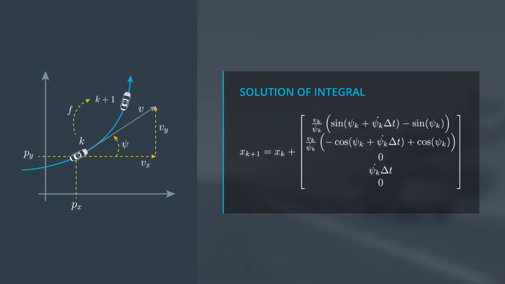
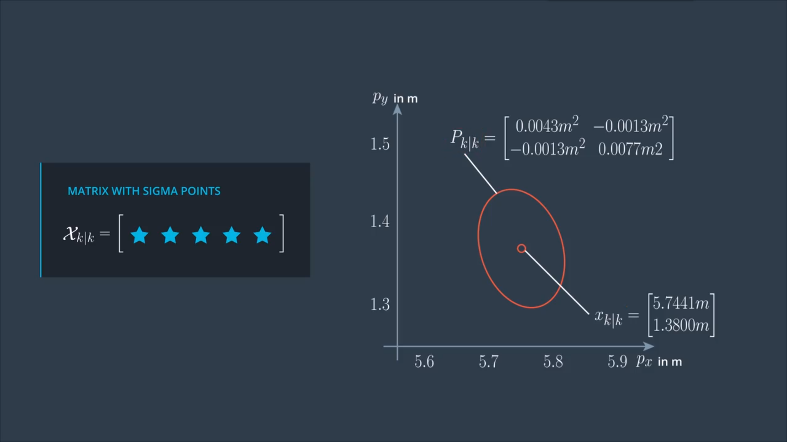
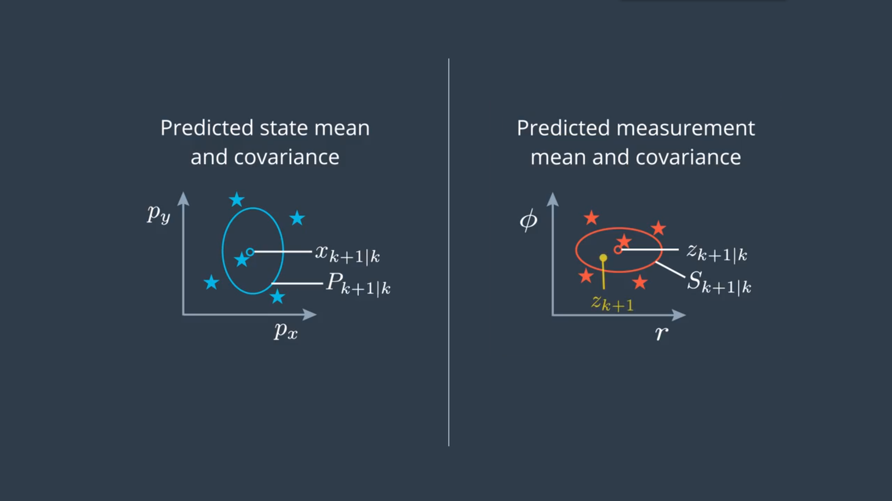
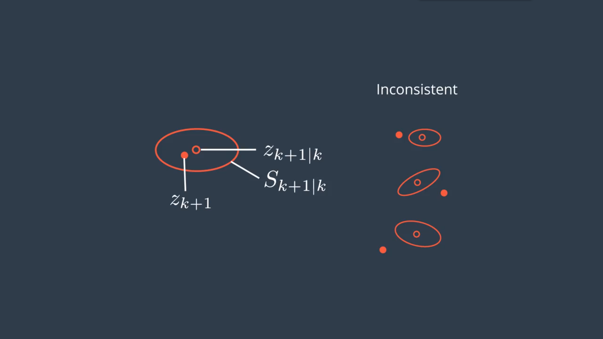

# *Udacity Self-driving Nanodegree*

## Reflection on Unscented Kalman Filters

#### *The CTRV Model*

In the extended kalman filter lesson, we used a constant velocity model (CV). A constant velocity model is one of the most basic motion models used with object tracking. However, assume a vehicle drives straight at first and then goes into a turn. If we apply a Kalman Filter to track the vehicle (using the process model from the last lesson, which assumes constant velocity), the process model would assume the car is moving tangentially to the circle, resulting in a predicted position outside of it.

In this case, there are many other models that have better performances, and each model makes different assumptions about an object's motion. Keep in mind that we can use any of these motion models with either the extended Kalman filter or the unscented Kalman filter.

* constant turn rate and velocity magnitude model (CTRV)
* constant turn rate and acceleration (CTRA)
* constant steering angle and velocity (CSAV)
* constant curvature and acceleration (CCA)

#### *The CTRV Model State Vector*

The model we use so far assumes objects always keep going straight. But in reality, they might also move with a constant turn rate and a constant velocity magnitude. This model is often called the CTRV model. Let's have a look at the state vector we are going to use. We keep calling the two-dimensional position of the bike $p_x$ and $p_y$, where $p$ stands for position. BUt instead of describing the velocity with $v_x$ and $v_y$, we use the speed $v$ and yaw angle $\psi$. Since we also want to estimate the yaw rate $\dot \psi$, we add it to the state vector too.

#### *CTRV Differential Equation*

Now let's see how the assumption of a circular motion leads to a process model. In this example, we have the car location at time k and need to predict where the car is at time k+1. The process model $f$ predicts the state at time k+1, given the state at time $x_k$ and a noise vector $\nu_k$, this is the function we want. Now what we have to do is to derive this process model.

Since we can not directly write down the process model simply by looking at this figure. But we can get the change rate of the state $\dot x$. From the geometric relations, we can directly derive how the change rate $\dot x$ depends on the state $x$, which is a differential equation. And we can derive this by expressing each of the five-time relatives of the state, independency of any of the state elements.

#### *CTRV Integral*

Now we have the complete differential equations, but how do we get from timestep k to timestep k+1? We can represent the difference between $d_t$ and $d_{t+1}$ by $\Delta t$. Then the state at time k+1 is given by the state at time k plus the integral over $\dot x$ from time $t_k$ to $t_{t+1}$. This can potentially be a very complex calculation, but in the special case of CTRV, this can be solved pretty easily.

In the first two rows, we can just insert the terms of the differential equation without solving the integral, we will do this later. The last three is relatively easy to compute, since the velocity, and the yaw rate are both constants.

For the first two rows, we actually have to solve the integral. There's no way around this time. First we can insert the assumption that the velocity $v$ is a constant. So we can move the velocity at time k $v_k$ as a constant before the integral. Also, we can explicitly express $\psi$ as a function of $t$ using again the assumption of a constant yaw rate.

As you may find, there is still one problem with our solution. For the top two term, the division is zero when the yaw rate is zero. This is an important case because it means the weakness driving on a straight road, which happens quite often. In this case, we can directly give the solution $v_k cos(\psi_k) \Delta t$ and $v_k sin(\psi_k) \Delta t$

#### *CTRV Process Noise Vector*

What we have introdeced so far is the deterministic part of the precess model. But of course, we also need to consider the stochastic part and that has something to do with the process noise $\nu_k$. We will describe the uncertainty of the process model with a two-dimensional noise vector $\nu_k$, consisting of two independent scalar noise processes.

The first noise process is the longitudinal acceleration noise $\nu_a$, which influence the longitudinal speed of the vihecle and randomly changes its value at every timestep k. The longitudinal acceleration is a normally distributed white noise with 0 mean and the variance $\sigma_a^2$.

The second noise process is the yaw acceleration $\nu_{\ddot \psi}$. It is also a normal distributed white noise with 0 mean and the variance $\sigma_{\ddot \psi}^2$.

So how does the noise vector affect the overall process model? We can again start from the bottom, and it's not hard to get the result like this by integrating the noises with $\Delta t$:

For the first two terms, clearly the yaw acceleration noise does have some influence on to the position and it will change the radius of the circle we drive. However, we can assume the effect of the yaw acceleration on each timestep is relatively small in comparison to other factors, we can neglect it by letting our car staying on the circle.

As for the effect of the longitudinal acceleration noise on the position. We have to go back to the differential equation and solve the integral again assuming a constant acceleration, not just a constant velocity. This is absolutely doable, but we can simply use an approximation here. We can consider the acceleration offset is the same as a car driving exactly straight from the current point with the current position. This approximation will be okay as long as the yaw rate is not too high, so the results of a and b will be: $\frac{1}{2}(\Delta t)^2cos(\psi_k)\cdot\nu_{a,k}$ and $\frac{1}{2}(\Delta t)^2sin(\psi_k)\cdot\nu_{a,k}$.

#### *Non-linear Model*

To deal with nonlinear functions, the UKF uses the unscented transformation. Let's quickly recall again what the problem is with nonlinear process models or nonlinear measurement models. For a Gaussian distribution, we have a state vector mean $x$ and the state covariance $P$ at a timestep k. What we want to do is predict the mean and the covariance tp timestep k+1. So we have $x_{k+1|k}$ and $P_{k+1|k}$, which are the estimation for timestep k+1 with the last measurement of timestep k. This is what we have after prediction, and also called a prior estimation. While the $x_{k|k}$ and $P_{k|k}$ are the estimation for timestep k, and the measurement at time k has already been taken into account. This is also called the posterior estimation.

These ellipses mean visualize the distribution of our uncertainty. All points on the line have the same probability density. If the uncertainty is normally distributed, these will have a shape of a ellipse. It is often called error ellipse, which can be seen as the visualization of the covariance matrix $P$.

If the process model is linear, then the process model will be easy to compute, where $Q$ is covariance matrix of the process noise. We can use the Kalman Filter to solve this prediction problem.

However, if the process model is nonlinear, the prediction is defined by a nonlinear function $f$, as we've derived in CTRV model. Predicting with a nonlinear function provides a distribution which is generally not a normally distributed anymore. It's not easy to calculate this prediction distribution. Let's say we use some fancy algorithm and let it run for a while. The result might look like this, which can also be done by a Particle Filter. As we can see, this is not a Gaussian anymore. Otherwise, it would be a ellipse again. So the predicted state distribution is not normally distributed anymore.

But what the UKF does is keep going as if the prediction was still normally distributed. This is not an analytical path anymore, just an approximation. What we want to find now is just a Gaussian that represent the real predicted distribution as close as possible. This mean value and the covariance matrix might look like this. So the question is, how to find this mean vector and this covariance matrix? This is exactly what the **unscented transformation** does for us.

#### *UKF Basics Unscented Transformation*

The unscented transformation solves this problem using **sigma points**.  It can be difficult to transform the whole state distribution through a nonlinear function. But it is very easy to transform individual points of the state space through the nonlinear function, and this is what sigma points are for.

The sigma points are chosen around the mean state and in a certain relation to the standard deviation $\sigma$ of every state dimension. This is why these points are called sigma points. They serve as the representatives of the whole distribution. Once we've chosen the sigma points, we just insert every single sigma point into the nonlinear function $f$ and they will come out somewhere in the predictive state space. All we have to do now is calculate the mean and the covariance of our sigma points group.

This will now provide the same mean and covariance as the real predicted distribution. But in many cases, it gives a useful approximation. In fact, we can use the same technique in the linear case and it provides the same solution as the standard KF, but it usually takes time longer than the usual way. So in general, an unscented transformation is just an approximation of the best Gaussian we can get close to through sigma points.

#### *Generating Sigma Points*

Below is the UKF processing chain, and we'll start at the beginning, the prediction step and we want to generate sigma points.

At the beginning of the prediction step, we have the posterior state $x_{k|k}$, and the posterior covariance matrix $P_{k|k}$ from the last iteration. They represent the distribution of the current state, and for this distribution, we now want to generate sigma points. The number of sigma points depends on the state dimension. And the state vector of the CTRV model is also shown here which has five dimensions. We should choose $2n_x+1$ sigma points.

The first point is the mean of the state, and then, we have another two points per state dimension which will be spread in different directions. In our case, this would be 11 points.

To make things easier right now, we will consider only two dimensions of our state vector, the position $p_x$ and the position $p_y$. This makes it easier to visualize what's happening. Now, that our state dimension is two, we are only looking for five sigma points. We'll calculate and store them in the matrix $\chi_{k|k}$. Every colomn of this matrix represents one sigma point.

Below is the rule for sigma point matrix. The first column of the matrix tells us what the first sigma point is, which is simply the mean state estimate. The second column contains $n_x$ more sigma points, here is two. In the square root matrix $A = \sqrt{P_{k|k}}$, we have two vectors pointing in different directions. And we multiply these vectors by $(\lambda+n_x)$. If $\lambda$ is larger, the sigma points move further away from the mean state. If $\lambda$ is smaller, the sigma points move closer to the mean state. This all happens in relation to this error ellipse. In our case, the overall spreading factor $\sqrt{(\lambda+n_x)}$ works out to square root of three and add it to the mean state. For the last column, it's just applied in the opposite direction. So the sigma points will all display as below.

#### *UKF Augmentation*

Now we know how to represent the uncertainty of the posterior state estimation with the sigma points, and we can put the sigma points into the process function. But be careful, the process function still contains the process noise vector $\nu_k$, which also has a nonlinear effect.

Below is the complete process model, considering the process noise vector. In the last lesson of Kalman Filter, the last term is what we called $\nu_k$, and we have to calculate a big process noise covariance matrix $Q$. The thing is, if we look into literature and we find this process noise $\nu_k$ might point to different vectors. Sometimes it means the last term in this equation, telling the influence of the process noise, on a specific state between k and k+1, so it has the same dimension as the state vector and depends on $\Delta t$. Mostly this is the case when we read about the standard linear Kalman Filter. But sometimes the authors mean the vector above which just lists the individual independent noise processes. Usually this is what authors mean when they write about the Unscented Kalman Filter.

So in this UKF lesson, the covariance matrix $Q$ of the process noise is quite easy and we just need to know the stochastic properties of these noise processes which we already defined. Then $Q$ can be given by a matrix only contains the variances of the noise processes. The covariance here are 0, because the longitudinal acceleration noise and the yaw acceleration noise are considered independent.

Now we clarify what the process noise vector is and what its covariance matrix $Q$ looks like. Then we can represent the uncertainty of the covariance matrix $Q$ with sigma points. The solution is called **augmentation**. Below is an overview on how we generated sigma points without considering $Q$. What we will do now is a little modification.

First, we should build the augmented state, where we add the noise vector to the state vector $x_{a,k}$. The augmented state dimension in our case becomes 7 and we need 15 sigma points now. The additional 4 sigma points will be representing the uncertainty caused by the process noise. We could also build the augmented covariance matrix $P_{a,k|k}$, which is just added matrix $Q$ as a lower right block. Finally, the way to generate the 15 sigma points is exactly the same as before with the augmented elements as input.

#### *Sigma Point Prediction*

Let's move on to the prediction of sigma points. What we have now is the matrix of augmented sigma points. For the prediction step, we simply insert every sigma point into the process model. Again we store every predicted sigma point as a column of a matrix $\chi_{k+1|k}$. One thing we should consider, the input to the process model is a 7 dimensional augmented vector, which contains 5 states and 2 noise, while the output is only a 5 dimensional vector.

#### *Predicted Mean and Covariance*

Let's look at the visualization again. First, we generated the sigma points. Then, we predicted them. Now, we want to use them to calculate the mean and the covariance matrix of the predicted state. The standard rule from a group of state samples is given by the equations below. And we need an additional weight for every sigma point.

The weights are calculated at the bottom of the diagram below. We can see that these weights somehow depend on the spreading parameter $\lambda$. We use it before to set how far we want to spread the sigma points. The reason we consider it again is that, before we had a covariance matrix and generated sigma points, now we are doing the inverse step. We have predicted sigma points and we want to recover the covariance matrix. So we also have to invert the spreading of sigma points. And this is what the weights do. Actually there is more than one way to define these weights and we can find several suggestions if we look into literature. And with these, we have all we need to complete the UKF prediction step.

#### *Measurement Prediction*

Since we've finished all parts of the Prediction, we can now go into the Update step and predict the measurement.

We have successfully predicted the state from timestep k to timestep k+1. Now we have to transform from the predicted state into the measurement space. The function that defines this transformation is the measurement model. Of course, now we have to consider what kind of sensor produced the current measurement and use the corresponding measurement model. The problem we have here is very similar to what we had in the prediction step. We need to transform a distribution through a nonlinear function so we can apply exactly the same on center transform approach as we did in the state prediction.

However, we can make two shortcuts here and make it a little easier. The first thing we did in the prediction step was generating sigma points. A popular shortcut is to reuse the same sigma points again. So we can skip generating sigma points this time. Also, we could skip the augmentation step. We need augmentation before because the process noise had a nonlinear effect on the state. Let's say we have a Radar measurement in this example. Here the measurement model was a nonlinear function, but the measurement noise only combines as a linear term. Thus instead of performing an augmentation, there's an easier way to consider the measurement noise, which we'll show later. So the only thing left is transforming the sigma points into the measurement space and using them to calculate the mean and the covariance matrix $S$ of the predicted measurement.

Again, we store the transformed measurement sigma points as columns in the matrix $Z$. Recall the measurement space of Radar. It is the radial distance $\rho$, the angle $\phi$, and the radial velocity $\dot \rho$. So this is a three dimensional space. Thus the matrix $Z$ has only 3 rows. Regarding for the measurement noise $\omega$, just put in 0 here, since we will account for the measurement noise later.

Now that we have the sigma points and the measurement space, we want to calculate the mean and the covariance of the predicted measurement. This is also very similar as before and given by the equations below. The only difference is here we add the measurement covariance noise. And this is how we account for the measurement noise. Remember we can do this instead of the augmentation here, because the measurement noise in our case does not have a nonlinear effect on the measurement but it's purely additive. That's all about how we predict the measurement.

#### *UKF Update*

Here comes the final step, to update our state and the covariance matrix with the measurement. What we have now is the predicted state mean and covariance, and the predicted measurement mean and covariance. Now we have to combine them and then compare with the precise measurement incoming at timestep k+1, which is $z_{k+1}$.

The update calculation closes the processing chain and produces the updated state mean and the updated state covariance matrix. These equations are exactly the same as for the standard Kalman Filter. The only difference here is how we calculate the Kalman gain $K$. Here we need the cross-correlation matrix between the predicted sigma points in the state space and the predicted sigma points in the measurement space. With all these, we're done processing the measurement at timestep k+1, and are ready to handle the next measurement at timestep k+2.

#### *Parameters and Consistency*

Now it's time to discuss how to choose noise parameters and how to evaluate this choice. This is not only related to the UKF, but it can be applied to any Bayesian filter. When we talk about our process and measurement models, we introduced several sources of uncertainty. In the process model, we introduced the process noise $\nu_k$. And in the measurement model, we introduced the measurement noise $\omega_k$. In case of Radar measurement, this was the noise of the distance measurement $\rho$, the angle measurement $\phi$, and the radial velocity $\dot \rho$. We also quantified the noise with the process noise covariance matrix $Q$ and the measurement noise covariance matrix $R$ which are the variances of the noises that quantify how strong the noise is.

However, we haven't discussed where we get these values from. Let's start with the measurement noise. This noise is usually written in the sensor manual and describes how precise the sensor can measure. For example, we might read the Radar can measure the distance $\rho$ with the standard deviation of 0.3 meters. This means we know the value for the variance $\sigma_\rho^2$ is 0.09 meters squared. We also have assume the noise is white and normally distributed. Which is of course not true for some sensors.

It is a little more difficult to choose an appropriate process noise. In reality, objects in a traffic enviroment don't move with wide acceleration noise. This would mean a driver constantly swiched between gas and brake. So we really apply a strong approximation here by assuming a white process noise.

A rule of thumb for getting useful values is the following. Try to estimate what the maximum acceleration is in our enviroment. Let's say we want to track cars in an urban enviroment. Then these cars usually don't accelerate or brake stronger than 6 meters per second squared. Now the rule of thumb says, choose half of the maximum acceleration as process noise. In this case, that's 9 meters squared over seconds to the power 4 as variance for the acceleration noise.

That's because it has been modeled as a Gaussian distribution with mean zero and standard deviation $\sigma_a$. In a Gaussian distribution, about 95% of our values are within $2\sigma_a$. So if we choose $\sigma_a^2 = 9\frac{m^2}{s^4}$, then we expect the acceleration to be between $-6\frac{m}{s^2}$ and $6\frac{m}{s^2}$ about 95% of the time.

If this is a good value for us really depends on our application. Is it important for our application to react fast on changes? Then we should choose the process noise a little higher. Is it important to provide smooth estimations? Then we should choose the process noise a little lower.

Usually we want to know if we set up the noise parameters correctly. For that purpose, we can run a consistency check on the filter. At every time cycle, we calculate the measurement prediction $z_{k+1|k}$ and the covariance matrix $S$ for this prediction. Then we receive the actual measurement $z_{k+1}$ for that timestep. In this example, everything looks okay. The actual measurement occurred somewhere inside the error ellipse.

But things might look differently. Imaging our results turn out to be like these. We constantly underestimate the uncertainty of the predicted measurement, which means our filter is not consistent. Of course, these are all stochastic processes and it might just be a natural coincidence. But if the results keep looking like these, this explanation is extremely unlikely. These might be more likely to be that our estimate is less precise than we think.

The same can happen in the other direction. Here we overestimate the uncertainty of our system, which means our estimate is actually more precise than we think. So this filter is also inconsistent.

A filter is consistent if it provides a realistic estimation uncertainty. It is very easy to check the consistency of our filter, and we should always do that when designing a filter. An important consistency check is called NIS, which means Normalized Innovation Squared. Its meaning is very intuitive. The Innovation is the difference between the predicted measurement and the actual measurement. And Normalized means we put it into relation to the covariance matrix $S$. That's why we have the inverse of the matrix $S$ here.

The NIS is just a scalar number and super easy to calculate. But we need to know what number to expect. For that we need to know something about the statistics of the NIS. The NIS value follows a distribution called $\chi^2$ distribution, which usually comes with a table like beblow. This table tells us the number we should expect for our NIS. The df term means degrees of freedom. That's the dimension of our measurement space. We have a 3D Radar measurement, so we just need to check the third row in this table. The first column says statistically in 95% of all cases, our NIS will be higher than 0.352. While the last column says in 5% of all cases, our NIS will be higher than 7.815.

So what we can always do is plot a 95% line, which in our case is 7.8. Then for every timestep k, calculate and plot also the NIS value. If we see something like below, then everything looks great. Sometimes we are over the 95%, but that's what we expect.

However, if we see something like the two below, it means we underestimate / overestimate the uncertainty in our system, like the example we saw before. Unfortunately, the NIS test can't tell us where the mistake comes from, but it gives us at least some feedback. In this case, it might be a good idea to adjust the process noise a little bit and try again.

